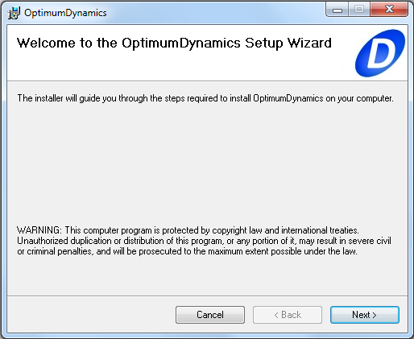

The following procedure should be undertaken to successfully install OptimumDynamics:

1. __Run__ the OptimumDynamics __Setup__ installer.  Ensure that you run the __setup.exe__ file and run as an administrator to ensure all components are installed successfully.
2. If a security warning popup box appears click __Run__
3. A setup wizard will open which will guide you through the installation, click __Next__

4. Read through the license agreement and select __I Agree__, then click __Next__
5. You may select to create shortcut icons on your desktop or start menu, then click __Next__
6. Browse to an installation directory or accept the default location, then click __Next__ 
7. Click __Next__ to begin the installation
8. The installation should begin and there will be a progress bar to update progress.  If a popup appears asking you to give permission for the program to make changes, click __Yes__
9. Once the installer finishes click __Close__
10. The program should now be successfully installed, you can run the program from the start menu or from the icon generated on your desktop

If you have any issues during installation, please contact us at [software@optimumg.com](mailto:software@optimumg.com) or by phone at +1 303 752 1562