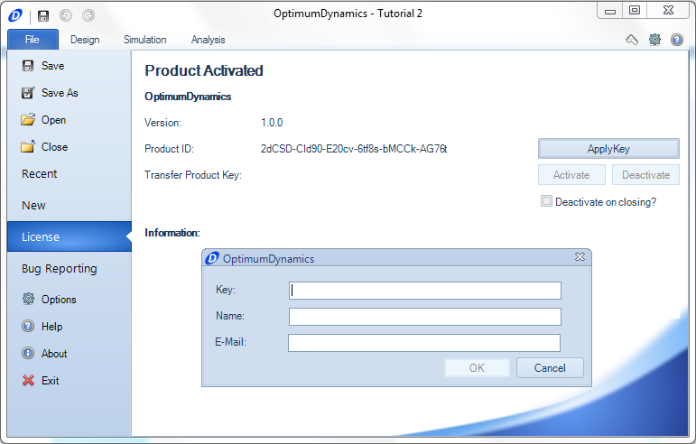

Before using OptimumDynamics you must enter your licensing information, you should have been given a license key with your purchase of OptimumDynamics. If you wish to purchase or obtain a trial key, please contact us at [software@optimumg.com](mailto:software@optimumg.com) or by visiting us at [our website](http://www.optimumg.com/software/optimumdynamics/trial/)

To add your license key

1. __Launch__ OptimumDynamics
2.  The software will automatically launch to the __File__ tab.  Click on the __License__ tab
3. Click on the __Apply Key__ button
4. Enter a __Key__,__Name__, and __Email__
5. If the supplied information is correct a __green__ check box will appear
6. Click on __Okay__ to accept

OptimumDynamics will periodically check your licensing information every 90 days.  There is a grace period of 5 uses if the license check fails.