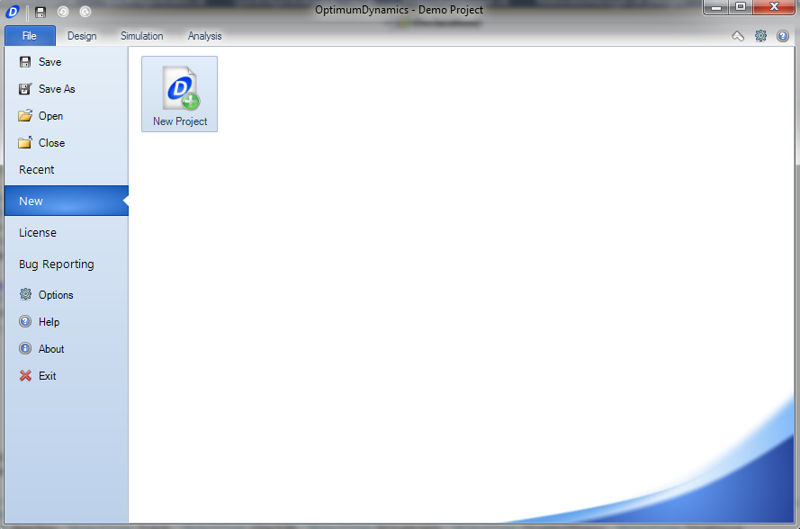
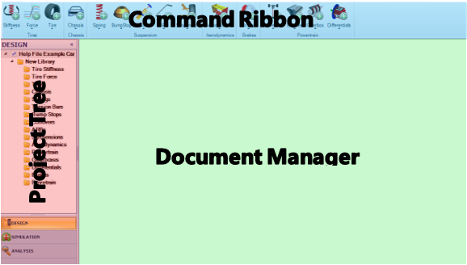
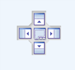
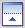
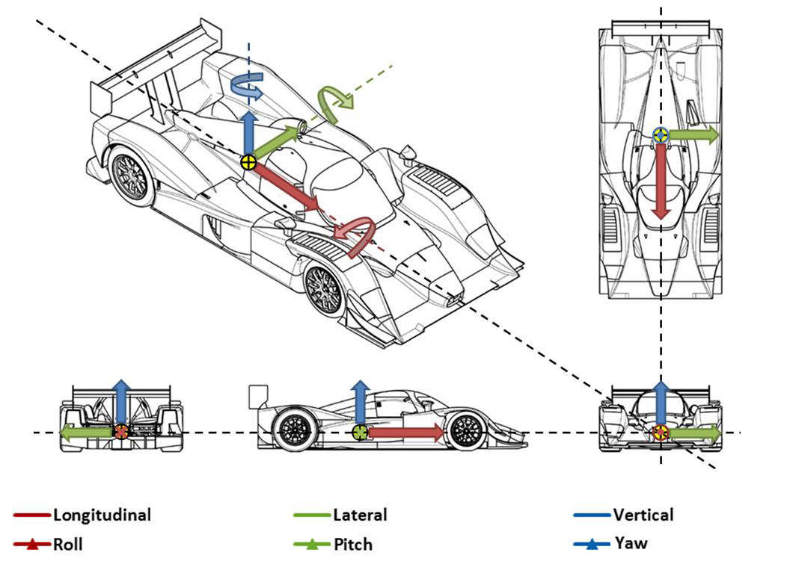

Once you have OptimumDynamics installed and your license applied you are ready to start using the software.  The following section describes how to get up and running with a new OptimumDynamics project.

# Launching OptimumDynamics

The first step is launching the application. After successful installation you can find the OptimumDynamics executable program in your computer start menu or as an icon on your desktop. OptimumDynamics requires administrator privileges to run. 

# Creating a New Project

The first time OptimumDynamics is used a new project must be created or alternately an existing project can be loaded. 

1.	On the __File__ tab, click __New__
2.	Select __New Project__
3.	You should give the project a relevant filename and select a location to save it
4.	Click __Save__

Upon creating a new project, a folder will be created on your hard drive in the selected directory. All the files related to your project will be saved in this project folder. OptimumDynamics separates the project into individual components, this makes importing and exporting between projects much easier. The file formats that are utilized in OptimumDynamics can be found [here](../3_Additional_Information/A_Hot_Keys_and_File_Types.md) 

# Software Basics

When opening the software, you will be presented with the following screen. This view is known as the project backstage and is used to manage your projects and to change license states. options can also be accessed from this screen.

The following functionality is available from the file tab.

Icon  |  Option  |  Description
- | - | -
 | __Save__ | Saves the current project that is open
 | __Save As__ | Saves a new copy of the project with the given filename
 . | __Open__ | Opens an existing OptimumDynamics project file
. | __Close__ | Closes the currently opened project
. | __Recent__ | Shows the most recently opened OptimumDynamics project files in order of date last accessed
. | __New__ | Creates a new OptimumDynamics project file 
. | __License__ | Displays current licensing information and allows the application of a license key
. | __Bug Reporting__ | Report software issues encountered
 | __Options__ | Adjust project settings
 | __Help__ | Opens the help file in a separate window
 | __About__ | Displays information regarding the current version of OptimumDynamics and contact details
 | __Exit__ | Closes the OptimumDynamics program

The software contains an intuitive user interface designed to make navigation and usage very natural and straight forward.  Selecting away from the __Backstage__ will bring up the main GUI.

The first part of the GUI to note is the __Project Tree__.  To keep the __Project Tree__ more organized, folders can be created to organize the items, setups, simulation inputs, results, and analyses created.  Folders can be created by right clicking on the main folder for the component, simulation, or analysis and selecting __Create__, and __Folder__.  Input a name in the Project Tree and click enter.  Pre-created elements can be put into folders by dragging and dropping to the folder.

The __Ribbon Control__ runs along the top section of the screen and allows quick access to the software functionality. From the ribbon menu it is simple to add new components, create simulations and develop new analyses.

The __Document Manager__ is the graphical base of the software and where all the data for components can be input.  Tabs at the top for each component allow for quick comparison of different components.  Tabs can be closed and rearranged as desired to keep the workspace organized to the user’s preference.  To rearrange the tabs, drag the tab that is intended to be moved.  A small icon will appear, showing the options for organizing the tabs.

Hover over the direction desired to organize the tabs and the tab will lock into location.  Several options are available to tailor the organization of the interface.

__Icon__ | __Description__
- | -
 | Places the document in the right section of the current view
 | Places the document in the top section of the current view
 | Places the document in the bottom section of the current view
 | Places the document in the left section of the current view
 | Places the document in the current view

# Options Menu

If, or when, you wish to change any of the project settings you can do this through the options menu. The most important thing here is the Unit settings; you can adjust from the default units to those you are most comfortable working in. When you are first starting, we recommend that you keep the other settings at their default values. You can also reset to the default options at any time.

__Setting Tab__ | __Description__
- | -
__Units__ | This option determines what units are used and displayed in the program. Most standard imperial and metric units can be selected.
__Numbers__ | Here you can select the number of decimal places to be displayed throughout the program.
__Document Layout__ | Here you can select the position layout of the documents within OptimumDynamics.
__Document Tab__ | This option allows you to define default colors for the worksheet tabs in the Document Manager. 
__Simulation Options__ | Here you can select the default number of steps for the following simulation types  * Force Simulation  *  Acceleration Simulation You can also change the simulation convergence options
__Object Names__ | Select whether you wish to be asked for a file name before creation
__File Properties__ | Here you can choose whether to display File properties such as ‘date created’, ‘created by’ etc. in the object documents.
__3D Visualization__ | Here you can select the type of vehicle you would like for visual display.

# Quick Access Toolbar

The quick access toolbar provides the user with a range of commonly used functions that can be set up to be used without the need of going through several menus.  Options are accessed by right clicking on an element in the command ribbon.  There is no limit to the number of elements listed in the quick access toolbar.  Below are the options for each component that can be used

__File__ | __Libraries__
- | -
__Aerodynamics__ | __Brakes__
__Chassis__ | __Powertrains__
__Suspensions__ | __Tires__
__Vehicle Setup__ | __Simulations__
__Simulation Inputs__ | __Reports__
__Results__ | __Track Maps__
__Math__ | __View__
__Worksheet__ | -

# Vehicle Conventions

SI units are used as the default setting for the software.  The units themselves are listed in the table below. Settings can be changed for any result from the option menu Three decimal places are the standard notation for all parameters.  The SAE coordinate system is the default coordinate system.

Component | Unit
- | -
__Acceleration__ | meter/second squared (m/s^2)
__Power__ | kilowatt (kW)
__Angle__ | degrees (deg)
__Pressure__ | pascal (Pa)
__Angular Velocity__ | revolution/min (rev/m)
__Stiffness Angular__ | newton meter/degree (Nm/deg)
__Area__ | metre^2 (m^2)
__Stiffness Linear__ | newton/millimeter (N/mm)
__Density__ | kilogram/metre^3 (kg/m^3)
__Stiffness Linear per Velocity__ | newton/millimeter/kilometer/hour (N/mm)/(km/h)
__Energy-Density__ | joule/kilogram (J/kg)
__Stiffness Linear per Force__ | newton/millimeter/newton (N/m)/N
__Energy-Work__ | kilojoule (kJ)
__Time__ | second (s)
__Force__ | newton (N)
__Torque__ | newton meter (Nm)
__Length__ | millimeter (mm)
__Velocity__ | kilometer/hour (km/h)
__Mass__ | milligram (kg)		

