#Understanding Vehicle Design

Vehicle design covers all the components used in a vehicle setup in OptimumDynamics. In this part of the project, a vehicle is built from its core components into an overall vehicle model that can be used for later simulation and analysis. The following components must be included in an OptimumDynamics vehicle definition if simulation is to be undertaken:
 
* __Tire Stiffness__

* __Tire Force Model__

* __Tire__

* __Chassis__

* __Spring/Torsion bar__

* __Coilover__

* __Suspension__
 
* __Brakes__

* __Drivetrain__
 
The following components can also be optionally included:
 
* __Anti-roll Bar (ARB)__

* __Bump Stop__

* __Aerodynamics__

* __Center Element__

* __Engine__

* __Gearbox__

* __Differential__
 
These components can be included in various forms of detail depending on the information known. In the vehicle design tab, new components can be defined either from the ribbon menu at the top of the screen or by right-clicking the component folders in the project tree. The following section has been set up to help a user create the fundamental components of a vehicle setup and then expand into the optional components that can be added.   The full list of components with links to the appropriate section is included on the next page.

#Library

The project tree comes pre-filled with a project library that stores the information for each component.  As the different vehicle components are created, they will be added to the library folder that corresponds to the component created.  Additional libraries can be added, allowing for better content management if there is more than one distinct vehicle in a project.  The libraries can be created by right clicking on the library intended and then selecting the new folder option.

#Constant Stiffness Tire

The stiffness of the tires on the vehicle is necessary so that the tire deflection can be accounted for in roll angle, pitch angle, ride height, load transfer distribution, and more. The constant tire stiffness model assumes that the tire vertical stiffness is a constant and unchanging parameter.

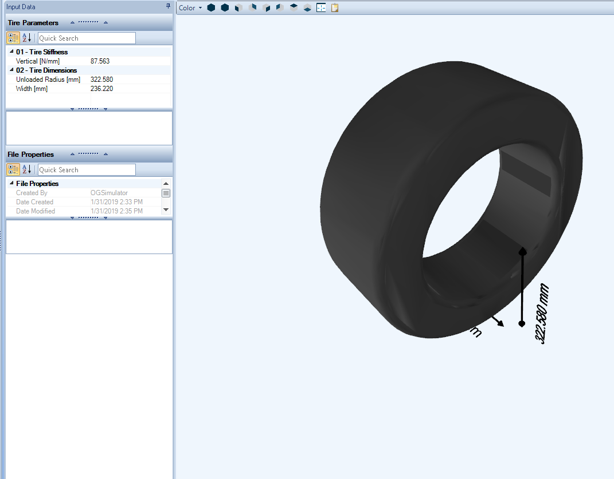

To solve for tire stiffness in the system, the tire stiffness must be a non-zero value and the unloaded radius of the tire must be known.  Please note, when validating a vehicle, the tire stiffness must be great enough that the car does not excessively compress the tires under static conditions.  The unloaded radius and width of the tire can either be measured or identified from the markings on the tire sidewall.

__Input Name__|__Description__
-|-
__Vertical Stiffness__|The vertical stiffness of the tire
__Unloaded Radius__|The outer radius of the tire while under no load
__Width__|Nominal width of the tire. This is only used for visualization purposes and does not affect the simulation results.

#Non-Linear Stiffness Tire

A non-linear stiffness tire is defined by a set of data points describing the force response with displacement. Data should be input that covers the entire possible operating range of the tire. These curves are often determined from physical testing.  OptimumDynamics then uses the data as a lookup table and interpolates the points in between each data point.  This is especially useful if the tires have a progressive spring rate or comparable characteristics.

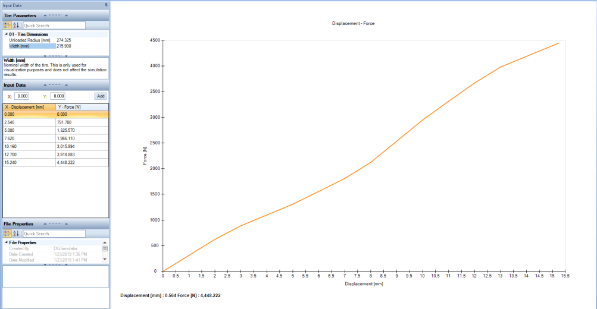

__Input Name__|__Description__
-|-
__Unloaded Radius__|The outer radius of the tire while under no load
__Width__|Nominal width of the tire. This is only used for visualization purposes and does not affect the simulation results.

#Constant Friction Tire

Tire forces are one of the driving components to a vehicle simulation as they are directly required for calculations of Yaw Moment, lateral acceleration, and longitudinal acceleration and indirectly used for calculations of roll angle, stability, ride height and more.  The vehicle simulation in OptimumDynamics relies on knowing the actual forces generated at the tire contact patch for each wheel.  The constant friction tire is the simplest type of tire model that OptimumDynamics offers. You must define the constant friction limit of the tire. The coefficient defined describes the maximum combined lateral and longitudinal friction factor. This assumes a linear friction limit with no account for slip angle or slip ratio.

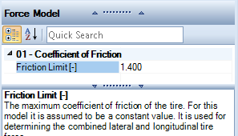

This can be approximated from physical testing by knowing the maximum lateral acceleration of the vehicle.  This assumes that there is negligible downforce being applied to the vehicle and a uniform friction coefficient across each tire. If the tires being used on each corner of the vehicle are not identical, then the friction limit will be different for each physical tire model being used.  If this is the case for the vehicle, loading on each of the tires must be known and each individual friction coefficient must be solved for.

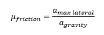

Note that this friction limit will be different for each physical tire model being used.  If this is the case for the vehicle, loading on each of the tires must be known.

__Input Name__|__Description__
-|-
__Coefficient of Friction__|The maximum coefficient of friction of the tire. For this model it is assumed to be a constant value. It is used for determining the combined lateral and longitudinal tire force

#Full Tire Model

More complex tire force characteristics can be determined in OptimumDynamics using full tire models. Several industry-standard tire models are included in OptimumDynamics for use and can be imported from external tire modelling software or from OptimumTire.

__Tire Model__|__Description__
-|-
__Pacejka 2002__|This model is given in Pacejka’s book "Tire and Vehicle Dynamics" published in 2002. It is like the ’96 model but has additional coefficients in the combined lateral and longitudinal models. It also includes models for the rolling resistance and overturning moment. This model includes 89 coefficients.
__Pacejka 2002 w/ Pressure Effects__|This model is described in the paper "Extending the Magic Formula and SWIFT Tyre Models for Inflation Pressure Changes" by Dr. Ir. A.J.C. Schmeitz, Dr. Ir. I.J.M. Besselink, Ir. J. de Hoogh, and Dr. H. Nijmeijer. This model incorporates the effect of inflation pressure into the Pacejka 2002 model. Ten additional coefficients, including the reference pressure Pi0, are added to the model. These coefficients appear in the pure lateral, longitudinal, and aligning torque models. This model includes 99 coefficients.
__Pacejka 2006__|This model is given in the second edition of Pacejka’s book "Tire and Vehicle Dynamics" published in 2006. This model is based off the 2002 model but includes significant modifications to the pure lateral and aligning torque models. An additional coefficient is also added to both the combined lateral and longitudinal models. This model includes 97 coefficients.
__Pacejka 96 Model__|This model is given in the 1996 paper "The Tire as a Vehicle Component" by Hans B. Pacejka. This model includes the combined lateral and longitudinal tire response as well as lateral camber response and load sensitivity. This model does not include the rolling resistance or overturning moment of the tire. This model includes 78 coefficients.
__Fiala__|The Fiala tire model is based on the physical characteristics of the tire. This model does not include combined longitudinal or lateral force, the effect of inclination angle, the lateral force offset at zero slip (from tire conicity or ply steer), or tire load sensitivity. More information about the Fiala model can be found in "The Multibody Systems Approach to Vehicle Dynamics", 2004, by Mike Blundell and Damian Harty.
__Harty__|The Harty tire model aims to provide a compromise between the complex Pacejka models and the limited Fiala model. Features of the Harty model include the ability to model camber thrust and the load dependency of cornering stiffness.
__Brush__|Brush tire models can be very simple or very complex. The model included is a very simple example of the brush model. The brush model is a physically based model that represents the tire as a row of elastic bristles that can deflect in the direction of the road. The deformation of these elements to applied forces represents the combined elasticity of the tire belt, carcass, and tread.
__Magic Formula 5.2__|This model is a close development of the Pacejka 2002 model. This model differs from Pacejka 2002 in the way that it models the effect of camber. The main advantage of the MF5.2 model is that models the effect of camber on the longitudinal coefficient of friction. This model includes 90 coefficients.

If the coefficients of the tire model are not known, a model that requires fewer input parameters such as the Fiala, Harty, or Brush models might be more conducive to create a representation of the tires.
Information about the tire coordinate system and the side of the tire is required to correctly interpret the tire forces into the vehicle coordinate system. You will first need to enter this information into the Model Information section of the input data.

__Input Name__|__Description__
-|-
__Coordinate System__|You may choose the coordinate system of the tire model. If you change this value, the tire model will be INTERPRETED according to the new coordinate system.
__Tire Side__|Represents the side on the tire. If a right tire is placed on the left side, it is automatically flipped.

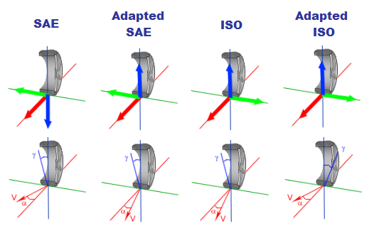

You can visualize the force and moment characteristics of the model in the charting area. You can select the type of graph you want to see and specify the inclination angles, tire pressure and vertical loads to visualize the model. This is useful to understand the behavior of your tire model and to make sure that you have correctly entered the model information.

__Input Name__|__Description__
-|-
__Inclination Angle__|This value represents an inclination angle of the tire
__Tire Pressure__|Defines the pressure in tires. This value is only used for plotting the chart!
__Toggle Graph Type__|Toggles the type of graph shown in the chart area: *Fy – SA:* Displays a lateral force vs. slip angle graph *Mz – SA:* Displays a self-aligning torque vs. slip angle graph *Fx – SR:* Displays a longitudinal force vs. slip ratio graph *Fy – SA – Fz:* Plots a lateral force vs. slip angle vs. vertical load graph *Fx – SR – Fz:* Plots a longitudinal force vs. slip ratio vs. vertical load graph
__Vertical Load__|This value represents a vertical load on the tire

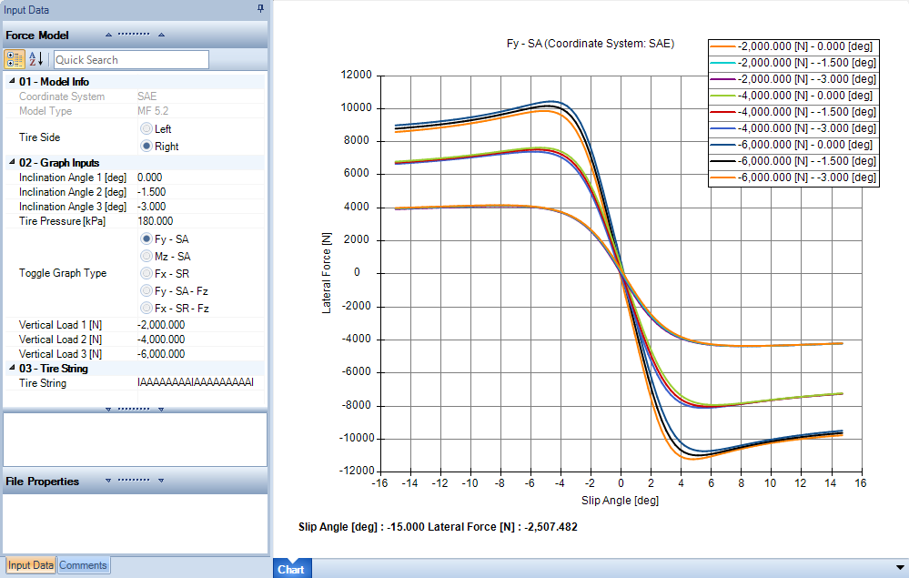

##Tire String Model

If you use OptimumTire to build your tire models from tire data, you can import your models with the OptimumTire tire string. OptimumDynamics will automatically calculate the tire forces directly from the tire string.

__Input Name__|__Description__
-|-
__Tire Side__|Represents the side on the tire. If a right tire is placed on the left side, it is automatically flipped.
__Tire String__|This value represents the tire string generated from OptimumTire

#Tire Assembly

This is a tire assembly that is composed of a previously defined tire stiffness model and a tire force model. Generally, at least two tire assemblies are created representing the front and rear tires of the vehicle. If you wish to investigate the effect of different tires, then you can create additional tire assemblies for each of these.

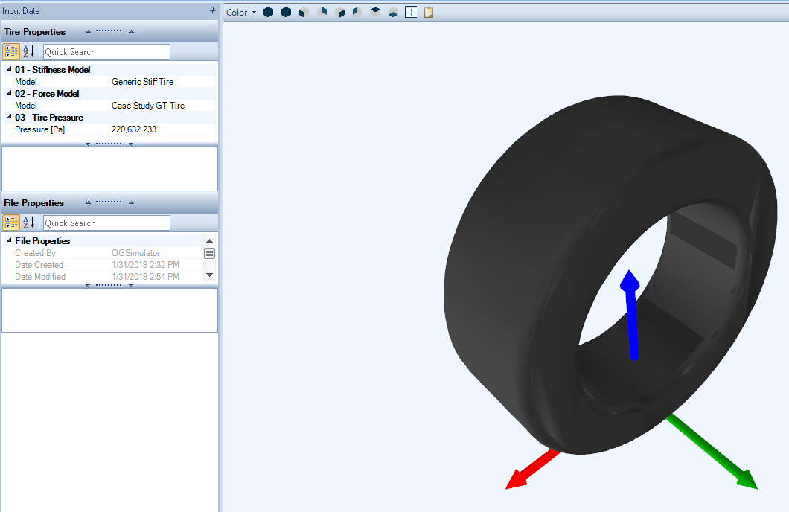

__Input Name__|__Description__
-|-
__Stiffness Model__|The tire stiffness model to be used in the tire
__Force Model__|The tire force model to be used in the tire
__Pressure__|The internal pressure of the tire. This value can be used by the Force Model or the Stiffness Model.

#Chassis

The chassis component is used to define the mass distribution of the vehicle. Either the distribution percentage or individual corner weight readings can be used to achieve this. A value for the center of gravity (CG) height is also required to fully define the vehicle chassis. The corner weight readings are often found by placing the vehicle on setup scales. The center of gravity height can either be estimated or determined experimentally.

__Input Name__|__Description__
-|-
__Toggle Inputs__|*Corner Mass* – The vehicle longitudinal and lateral CG position is determined based on the measured corner weights *Mass Distribution* – The vehicle CG longitudinal and lateral position is calculated based on the mass distribution
__Symmetry__|The vehicle is assumed to be symmetric when this is checked. The left and right side of the vehicle are assumed to be equal in terms of corner weights and the mass distribution is 50:50
__Corner Mass__ [Corner Mass toggled]|Input the weight on each corner of the vehicle if symmetry is unchecked. Input the weight on a single front corner and a single rear corner if checked
__Total Mass__ [Mass Distribution toggled]|The total mass of the vehicle and driver
__Mass Distribution__ [Mass Distribution toggled]|The front to rear % of mass distribution. If symmetry is unchecked then you will also need to enter the left to right % of mass distribution
__CG Input__|*Reference Ride Height* – The entered CG height is referenced from the ground plane. The software will re-calculate the CG with respect to the chassis bottom based on the given reference ride heights *Chassis Bottom* – The entered CG Height is referenced from the bottom plane of the chassis
__CG Height__|The height of the vehicle CG using the given reference system determined by the CG input toggle
__Reference Front Ride Height__ [Reference Ride Height toggled]|This is the front ride height of the vehicle when the CG height was determined. The front ride height is measured vertically from the front track.
__Reference Rear Ride Height__ [Reference Ride Height toggled]|This is the rear ride height of the vehicle when the CG height was determined. The rear ride height is measured vertically from the rear track.
__Non-Suspended Mass__|This is the mass of the non-suspended components for that corner or axle depending on your toggled input option.
__Delta Non-Suspended Mass__|This is the offset of the equivalent CG position of non-suspended components. This offset is positive upwards from the wheel center. This is usually taken to be 0
__Front Ride Height__|The front ride height in static conditions. This needs to be measured in the same place as that of the Reference Front Ride Height (If selected). This value also corresponds to the front aerodynamic ride height when an aerodynamic map is used in the vehicle setup.
__Rear Ride Height__|The rear ride height in static conditions. This needs to be measured in the same place as that of the Reference Rear Ride Height (If selected). This value also corresponds to the front aerodynamic ride height when an aerodynamic map is used in the vehicle setup.

The CG height can be referenced in one of two ways: reference ride heights or chassis bottom. If the CG height is referenced using the reference ride height, the ride height is the distance from the ground to the vehicle CG at the specified ride height.

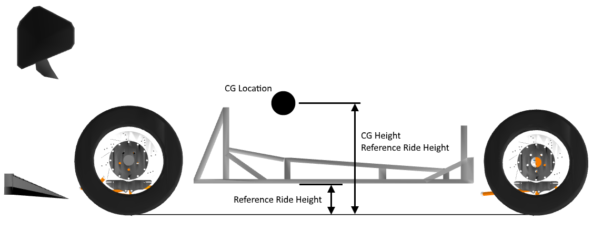

If the CG location is referenced to the chassis bottom, then the CG height is defined as the distance between the CG location and the bottom of the chassis. This is the CG height when the ride height is set to zero.

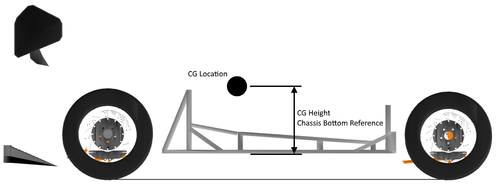

Another feature of the Chassis object is the 3D visualization. The 3D view displays a generic Chassis with the overall and the equivalent corner masses located and labelled. The size of the spheres change depending on the magnitude of the mass specified.

* Front Left:

* Front Right

* Rear Left

* Rear Right

The 3D visualization also works as a component editor. By clicking on any of the circles you will bring up the respective property editors.

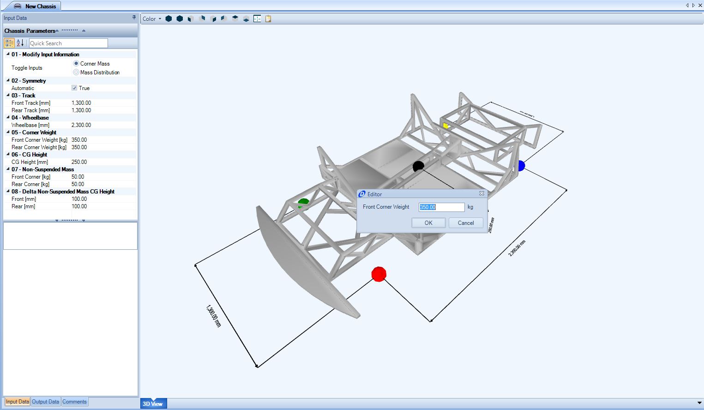

#Linear Spring

The vehicle springing is necessary to allow the suspension to operate. Spring stiffness is an especially important value to have accurate as it is used to find dynamic ride height, lateral, longitudinal, and vertical elastic load transfer, and can greatly effect vehicle balance and lateral capabilities.  Some knowledge of this mechanism is required to determine how much, and in what way the suspension will move when inputs are applied in the simulation.

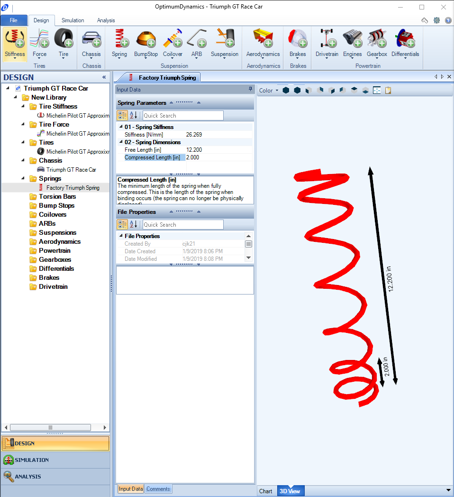

A linear spring assumes a constant spring rate across the defined operating range. This value is usually given when springs are purchased, or it can be determined experimentally.

__Input Name__|__Description__
-|-
__Stiffness__|The stiffness of the spring
__Free Length__|The length of the spring under no load
__Compressed Length__|The minimum length of the spring when fully compressed. This is the length of the spring when binding occurs (the spring can no longer be physically displaced). 

#Non-linear Spring

A non-linear spring model is defined by a set of user defined data points. The data describes the force response of the spring with displacement from its free length. Data should be added that covers the entire possible operating range of the spring from its free length to its compressed length. This data is often determined from physical spring testing.

__Input Name__|__Description__
-|-
__Free Length__|The length of the spring under no load
__Compressed Length__|The minimum length of the spring when fully compressed. This is the length of the spring when binding occurs (the spring can no longer be physically displaced). 

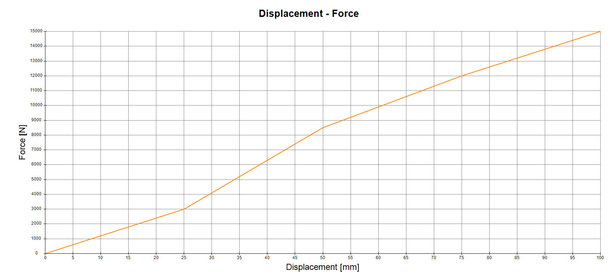

Spring data can also be imported using a .csv or an Excel file.  The data inputs will remain the same, though an interface to select the data will come up, allowing you to input the data for the displacement and the data for the spring force.  Additionally, the table can be created by copying data from an Excel sheet or table and pasted into the input window. Copy the columns that correspond to the displacement and force, then select the first row in the table in OptimumDynamics and paste the data.

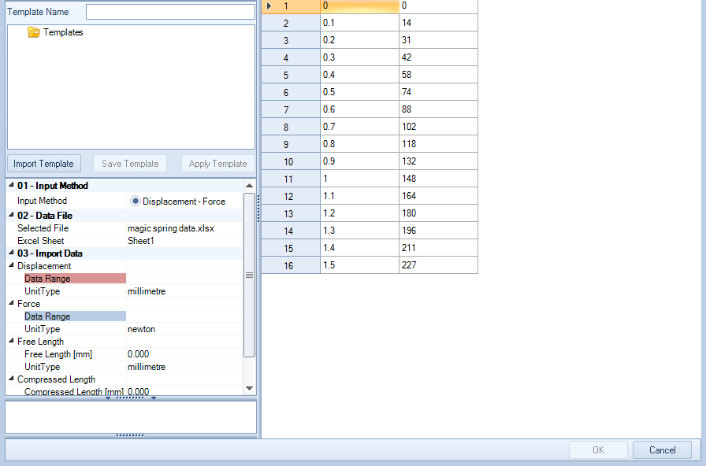

#Linear Torsion Bar

An alternate to a linear spring, a linear torsion bar can be defined as the springing element. This is accessed through the spring tab in the command ribbon. A linear torsion bar assumes a constant torsional spring rate. The torsion bar displacement is zero when the suspension is in full droop.

Note that these are not the same components as used for the Anti-Roll Bars.  Also note that torsion bars and coil springs are not interchangeable if using anything other than a linear suspension.  Both can only be used where expected in the suspension design.

__Input Name__|__Description__
-|-
__Stiffness__|The torsional stiffness of the bar
__Preload__|The preload of the torsion bar

#Non-linear Torsion Bar

A non-linear torsion bar model is defined by a set of user defined data points. The data describes the torque response of the bar with angular displacement. Data should be added that covers the entire possible operating range. This data is often determined from physical testing.  Inputs can be created using either an angular displacement, Additionally, as with the linear spring, the table can be created by copying data from an Excel sheet or table and pasted into the input window.

#Linear Bump Stops

Bump stops are a common component seen on dampers.  They are used to limit the maximum amount of suspension movement by increasing the effective spring rate when engaged. Bump stops can also be a detriment to a driver as they can cause a rapid increase in elastic load transfer, causing the vehicle to become unstable. There are three ways in which bump stop models can be handled in OptimumDynamics. 

The first option is to simply leave the bump stop undefined, this is ok if there are either no bump stops in the system or if they do not engage during use. 
The second option is to choose a linear bump stop. This works in an identical way to a linear spring where a constant spring rate is assumed over the defined operating range of the bump stop.

__Input Name__|__Description__
-|-
__Stiffness__|The stiffness of the bump stop
__Free Length__|The length of the bump stop under no load
__Compressed Length__|The minimum length of the bump stop when it is fully compressed. The bump stop can no longer be physically displaced

#Non-linear Bump Stops

A non-linear bump stop is defined by a set of data points describing the force response with displacement from the bump stop free length. Data should be input that covers the entire possible operating range of the bump stop (from its free length to its compressed length).  Additionally, the table can be created by copying data from an Excel sheet or table and pasted into the input window. These curves are often determined from physical testing.

__Input Name__|__Description__
__Free Length__|The length of the bump stop under no load
__Compressed Length__|The minimum length of the bump stop when fully compressed. The bump stop can no longer be physically displaced

#Coilover

This is an assembly of a previously defined spring and/or bump stop model. In addition to defining the spring and/or bump stop components you will also need to define the corresponding gap or preload. 

Both the gap and preload are defined with the coilover unattached from the vehicle and fully extended. If the spring rattles loose in the coilover then there will be a positive spring gap. The spring gap describes the distance that the coilover would have to compress before it is in contact with the spring.  

If the spring does not rattle loose then there is some static preload and there will be a negative spring gap, you should input a negative value that describes how far the spring is compressed from its free length. If the spring gap is negative, then this can also be described by a positive preload force. The preload force corresponds to the force required to compress the spring from its free length to its current length. A similar process is taken for the bump stop. Also note that you cannot define a gap and a preload force as these are equivalent measurements.

It is important that the coilover geometry is also included. This includes the eye to eye length of the coilover when fully extended and the eye to eye length when fully compressed. The free length of the coilover needs to be greater than the free length of the spring you have chosen to install.

The spring and bump stop are considered as springs in parallel when engaged. The engagement point of the bump stop can be defined using the bump stop gap. A negative gap indicates a preload on the bump stop. You can see the overall response of the system in the resulting force vs displacement chart for the coilover.

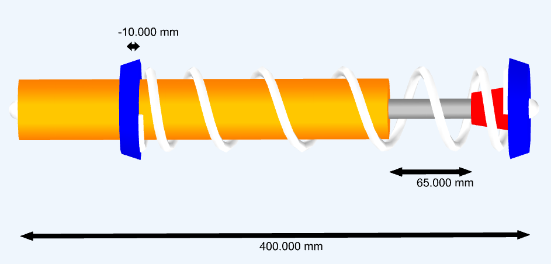

__Input Name__|__Description__
-|-
__Coilover Type__|The type of coilover: *Compression* – generates force when compressed *Tension* – generates force when extended
__Spring__|The spring model to be used in the coilover
__Spring Gap__|The distance between the spring and the coilover mount at full droop. If the spring is loose in the coilover then there is a positive spring gap. If there is static preload on the spring, then this should be entered as a negative spring gap.
__Spring Preload__|This value represents the preload of the spring. By adjusting this value, the spring gap will automatically be set. The preload displacement that is induced by this force cannot exceed the maximum displacement of the spring or coilover.
__Bump Stop__|The bump stop model to be used in the coilover
__Bump Stop Gap__|The distance between the bump stop and the coilover mount at full droop. This is normally a positive value to indicate that the damper is not preloaded so far as to be touching the bump stop. A negative value here results in a bump stop preload.
__Bump Stop Preload__|This value represents the preload of the bump stop. By adjusting this value the bump stop gap will automatically be set. The preload displacement that is induced by this force cannot exceed the maximum displacement of the bump stop.
__Extended Length__|The maximum length of the damper (eye to eye) when fully extended. At this point the coilover can no longer be physically extended.
__Compressed Length__|The minimum length of the coilover when fully compressed. At this point the coilover can no longer be physically displaced.

#Linear Anti-Roll Bar

Excluding select off road vehicles and some design constrained vehicles, most vehicles have a mechanism to react the roll forces of a vehicle. The anti-roll bar (ARB) on the vehicle only provides suspension stiffness during vehicle roll and has no effect during heave motion. A linear ARB is assumed to have a constant spring rate over its range of travel. The stiffness of the ARB is taken at the tip of the ARB level arm. This can be calculated knowing the material properties and geometry or it can be evaluated experimentally.

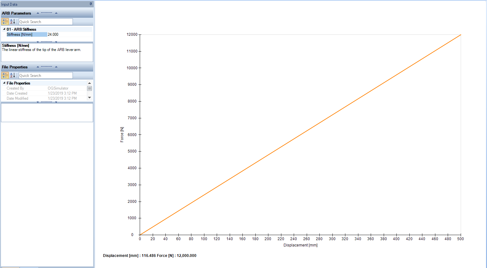

__Input Name__|__Description__
-|-
__Stiffness__|The linear stiffness of the tip of the ARB lever arm

#Non Linear Anti-Roll Bar

A non-linear ARB is defined by a set of data points describing the force response with displacement. Data should be input that covers the entire possible operating range of the ARB. These curves are often determined from physical testing. The non-linear ARB can be especially useful if using a non-elastic material for the anti-roll element, be it polymer or composite or a non-elastic metallic component.  A non-linear anti-roll can be especially useful for highly aerodynamic sensitive vehicles that require a progressive roll gradient in order to reduce the losses in aerodynamic forces due to a high roll angle.

__Input Name__|__Description__
-|-
__Toggle Inputs__|Toggle Inputs. You may choose to enter the Non-Linear information based on the following: *Displacement* – Force: The force response of the ARB as a function of linear displacement *Angle – Force*: The force response of the ARB as a function of angular rotation. You must also enter the level arm length when using this option
__Lever Arm Length__|The length of the ARB arm. This is the perpendicular distance from the end of the ARB to the ARB pivot axis. This is used to calculate the relation between angular and linear displacement of the ARB.

#Linear Suspension

Suspension definition is important as it describes the layout and motion of the vehicle. When defining a linear model the hard points and actuation of the suspension is not known and motions are instead defined using linear models. Different front and rear suspensions will need to be made. The linear suspension model can be beneficial for determining high-level reactions of the suspension design before spending too much time working with a complex model.

__Input Name__|__Description__
-|-
__Symmetry__|The suspension is assumed to be symmetric when this is checked. If the suspension is asymmetric then parameters will need to be defined for both corners of the suspension
__Track__|The lateral distance between the tire contact patches
__Tire__|The tire model to be used in the suspension
__Static Camber__|The static camber angle. A negative value indicates that the top of the tire is leaning inwards towards the chassis centerline.
__Camber Gain__|The camber change due to suspension movement. A negative value indicates that the camber will become more negative when the vehicle is pushed down.
__Static Toe__|The static toe angle. A negative number indicates toe-in.
__Toe Gain__|Change in toe due to suspension movement. A negative value indicates that the toe angle will change towards more toe-in when the vehicle is pushed down.
__Coilover__|The coilover model to be used in the suspension object
__Coilover Motion Ratio__|This value represents the ratio wheel motion/coilover motion
__ARB (Optional)__|The ARB model to be used in the suspension
__ARB Motion Ratio (Optional)__|This value represents the ratio wheel motion/ ARB motion
__Center Element (Optional)__|Select a previously defined center element model
__Center Element Motion Ratio (Optional)__|This value represents the ratio of wheel motion/center element motion
__Static Roll Center Height__|This is the height of the roll center as referenced from the vehicle ground plane (the vehicle is stationary on the ground).
__Anti-Effect Percentage__|This value represents the percentage of longitudinal weight transfer that will be geometric. The higher this value is the less suspension travel there will be.
__Steering – Wheel Displacement__|This value is used to determine how far the wheel travels up or down when the steering wheel is turned. A positive value indicates that the inside wheel center will move down
__Steering Ratio__|This is the ratio of the steering angle to the wheel angle (steering angle/steering wheel angle)

#Non Linear Suspension

If you are familiar with OptimumKinematics then you should have no issues with designing or importing a 3D geometric suspension design. For those unfamiliar with the process the following sections describe in additional detail what is required.
A non-linear model can be described geometrically if you know the 3D location of your vehicles hard points and actuation. This requires that you specify the [X, Y, Z] locations and orientation of every suspension component. You will also need to select your Tires, Coilovers and optionally an ARB and Center Element if applicable. 
It is also possible to directly import an existing OptimumKinematics file into the project. When using this method, the suspension parameters are found by running a full kinematic analysis of the suspension layout.

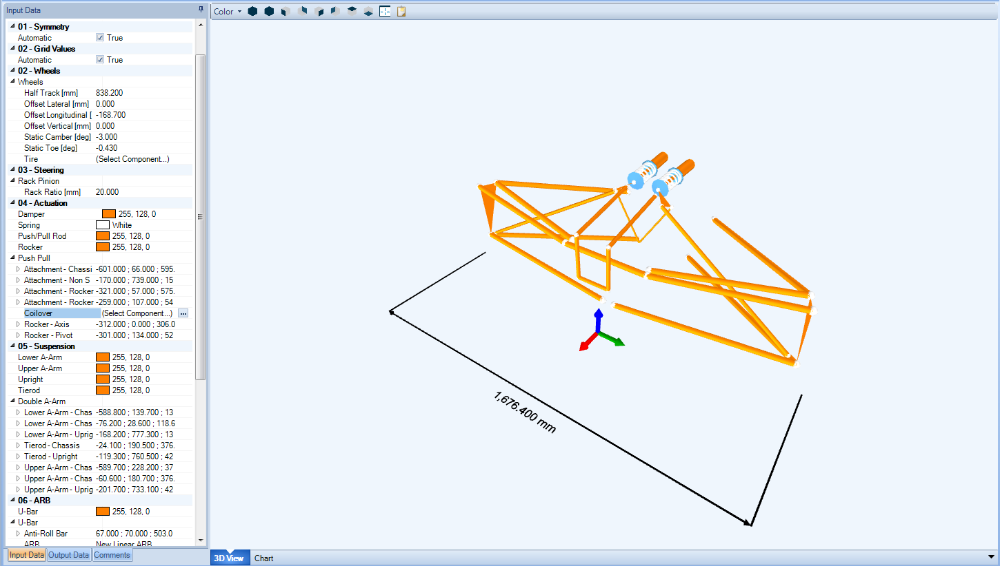

In the non-linear suspension you can also specify the lookup grid for the kinematics. When a simulation is run with a non-linear suspension the vehicle is first operated geometrically and a lookup table is generated. The grid defines the range for this table and the number of steps. During an actual simulation this lookup table is used for determining new camber, toe etc.… If you choose to manually specify the grid then you must ensure that the defined grid will cover the maximum range of suspension motion. You may get an extrapolation or failure error if this is not done.

__Input Name__|__Description__
-|-
__Grid Values – Automatic__|When set to true the range of motion of the suspension is automatically calculated. If set to false it is up to you to determine the useable range of motion of the suspension.
__Negative Steering [Grid Values – Manual]__|The maximum negative steering allowed by the suspension
__Positive Steering [Grid Values – Manual]__|The maximum positive steering allowed by the suspension
__Number of Steering Steps [Grid Values – Manual]__|The number of steering steps to calculate between the maximum and minimum set
__Wheel Displacement [Grid Values – Manual]__|The maximum positive wheel displacement allowed from the full droop condition (which is determined by coilover free length).
__Number of Wheel Displacement [Grid Values – Manual]__|The number of wheel displacement steps to calculate
__Rack Ratio__|The steering rack displacement / one steering revolution

####*Creating a Suspension*

After a non-linear suspension has been added to the project you will be presented with the following screen that is used to define the suspension type that is being created.

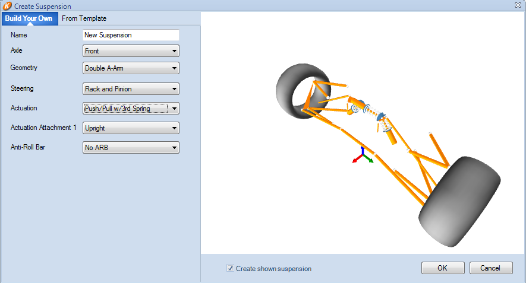

OptimumKinematics has many premade front and rear suspension setups to choose from. Within the suspension setups you maintain the ability to modify any of the existing setups or create a suspension setup from scratch. The following options are available to specify the suspension type and combination when made from scratch.  Note that currently OptimumDynamics does not support dependent suspension types in the analysis.

__Input Name__|__Description__
-|-	
__Axle__|Is the suspension design for the front or rear of the vehicle?
__Geometry__|The type of suspension geometry, including Double A-Arm Five Links MacPherson Strut MacPherson Independent Arms MacPherson Pivot Arm __[Front Only]__ Multilink __[Rear Only]__ Semi-Trailing Arm __[Rear Only]__
__Steering__|The type of steering system __[Front Only]__ Rack and Pinion Recirculating Ball Tierod Attachment	The attachment point for the tierod __[Rear Only]__ Chassis Lower A-Arm Upper A-Arm
__Actuation__|The type of actuation system including: Direct CoilOver Separate Springs/Dampers Push/Pull Torsion Bar MonoShock Rotational MonoShock Slider Push/Pull w/ 3rd Spring Push/Pull w/ 3rd Spring Constrain
__Actuation Attachment__|The attachment point for the actuation system Upright Lower A-Arm Upper A-Arm
__Anti-Roll Bar__|Select the type of ARB U-Bar U-Bar Rocker T-Bar T-Bar w/ 3rd Spring

####*Input Data*

After a suspension has been created, additional suspension parameters can be entered in the Suspension Input Data pane. This pane defines all the input parameters for a given suspension, including the location of the end points for all suspension members, steering geometry properties, wheel and rim information and any non-suspension reference points of your choice, such as center of gravity or lowest bodywork points.

The following figure shows how points are highlighted in ‘red’ in the 3D Visualization when you select a point in the Input Data window.

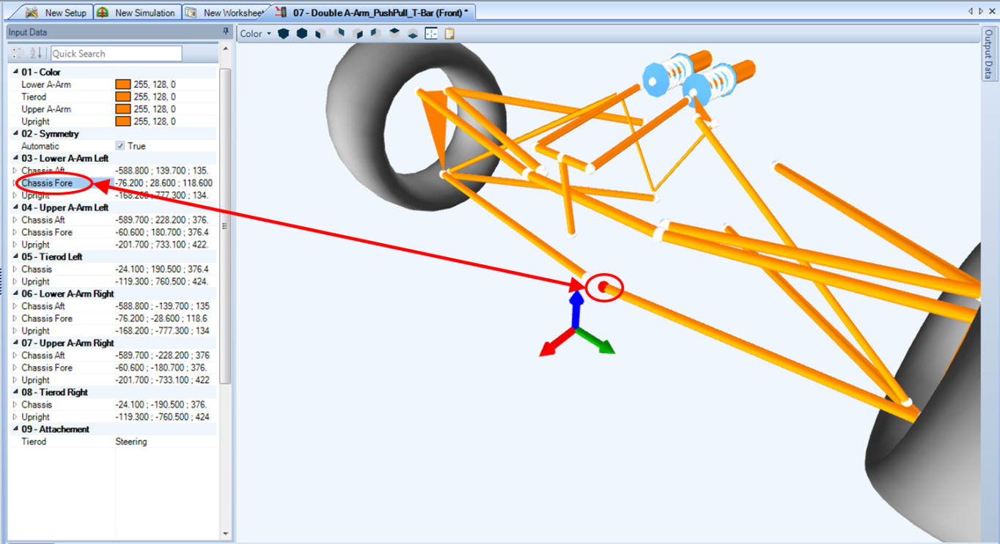

The location of each point can either be given as a list of semicolon (;) separated x, y, z points (IE – x,y,z) or the input item may be expanded and each x, y, z point entered individually. The values for all points should reflect their location when the car is at static.

NOTE - If you hold down the ‘CTRL’ key and click and hold on a point you can drag it in the 3D visualization window. While dragging the point you can also notice that the coordinates in the Input Window will be instantaneously changing with your mouse movement.

Alternatively, a suspension point may be double clicked upon in the 3d visualization window – allowing the x, y, z coordinates to be adjusted directly from the visualization pane. The following figure shows this pane.

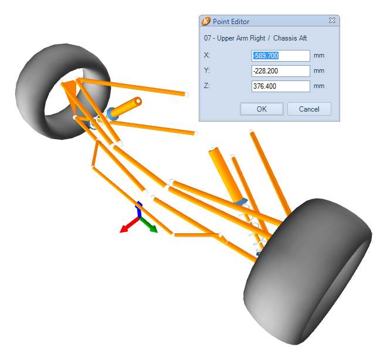

When creating the suspension, the full droop and the full compression can either be automatically defined by the simulation or by a manual input set.  The automatic motion defines the full droop of the suspension as the fully extended length of the coilover.  The compressed length is then defined as the damper fully compressed length.  Uniform steps are then created across the motion to create the suspension motion lookup table.

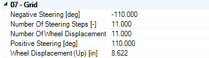

When the manual grid is selected, options are available to create the steering range, the number of steps in the steering motion, the number of steps in the wheel displacement, and the displacement of the suspension from full droop.  The manual mode will still use the fully extended length of the suspension, but will now have a manually defined point in which it will compress to.

####*Modify Suspension*

Modifying suspension geometry allows you to ensure that the geometry created matches that of your car.  This can be done at any point, though it will reset whatever parameters are changed in the input data

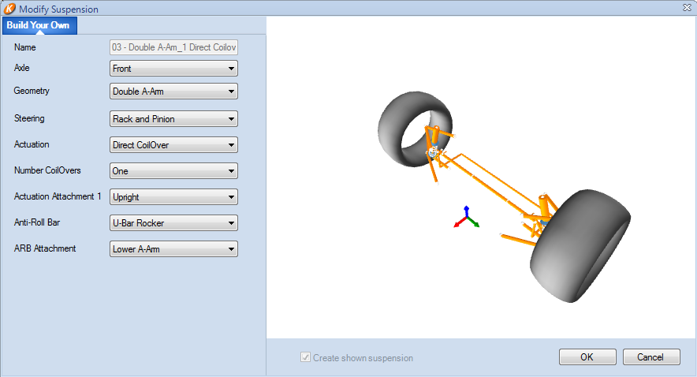

####*Importing and Exporting*

Suspension configurations can be imported and exported from the Ribbon Control Bar. Both OptimumKinematics projects and Excel files can be imported, allowing for most assemblies to be used in OptimumDynamics.

####*Output Data*

After the information on the input tab has been completed, the corresponding information regarding the newly create suspension is available under the output tab.

Output channels can be quickly sorted through, via the quick search box. Search results will be displayed if a channel contains the search string anywhere inside the channel name.

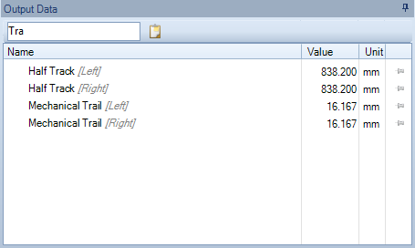

Output items of interest may be ‘pinned’ to the top of the list, ensuring that they are always easier to find.

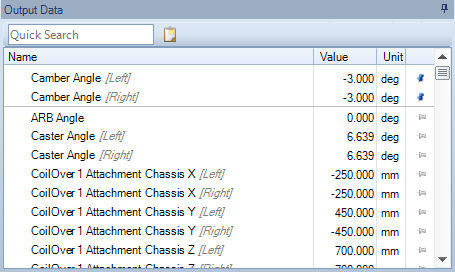

##Simple Differential

The differential divides the drive torque from the engine between the left and right side of the car and/or allows the wheels to spin at different speeds.  The effects of the differential are considered when calculating the net torques being applied on the wheels being driven through the differential.  The two constant state differential types are listed in the table.

__Input Name__|__Description__
-|-
__Differential Type__|*Open Differential* – the application of torque is equally split between the left and right wheels.  As a result, the wheel speeds will vary *Spool* – The left and right wheels will have identical angular speed, as a result the torque distribution will vary accordingly while additional slip is created on the inside wheel.

##Salisbury Differential

If a constant state differential does not represent the design of the vehicle being used, a Salisbury differential can be input.  The Salisbury differential will split the torque between the two wheels based on the input torque, the output torque at the wheels, and the slip ratio between the left and right wheels on the axle.

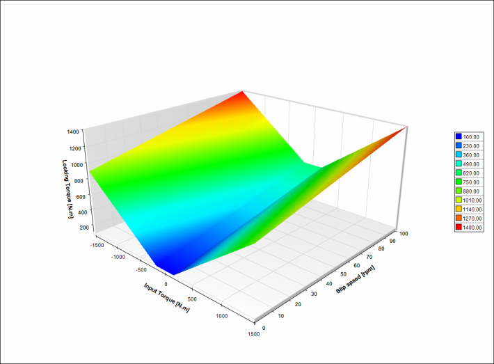

__Input Name__|__Description__
-|-
__Ramp Coefficient Brake__|This value is the ratio of locking torque to the input torque when the vehicle has an applied braking/coasting torque
__Ramp Coefficient Drive__|This value represents the increase in net torque to input torque required to lock the differential under acceleration.
__Static Preload__|This value is the locking torque required when the input torque is zero.
__Viscous Coefficient__|Ratio of slip between the left and right wheels required to lock the differential

#Simple Brakes

The braking system of the vehicle can be defined simply by the location of the brakes and the distribution of braking force front to rear. The braking distribution is assumed to be constant in this model and does not depend on the hydraulic layout of the actual braking system.

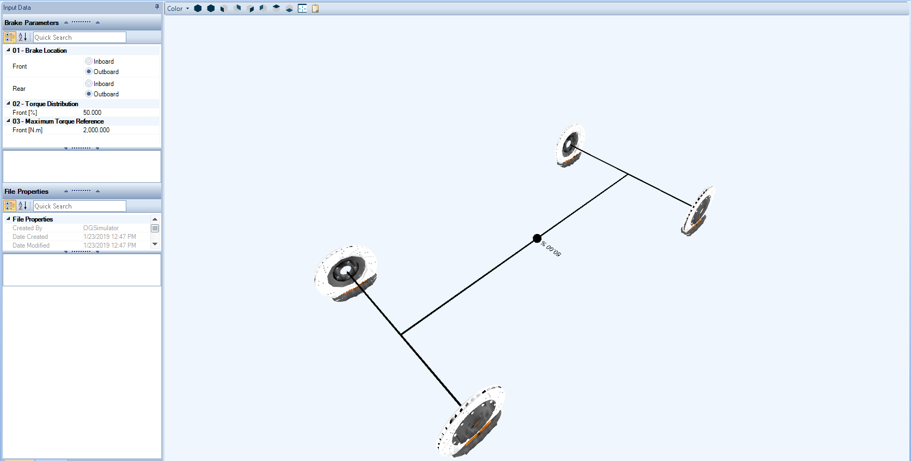

There are options for either brakes mounted inboard of the wheel axle or mounted outboard (most traditional configurations are outboard).  The maximum front braking torque capable for the system is also requested.  This can be solved by finding the maximum braking force at the front wheels followed by the torque being applied to the wheels.  The front braking force can be found using the following equation:

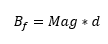

Where “B” is the braking force, “a” is the maximum deceleration of the vehicle in g, “d” is the brake distribution of the vehicle, “M” is the mass of the vehicle, and “g” is the acceleration due to gravity.  The torque can now be calculated using this equation:

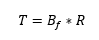

Where “T” is the front braking torque and “R” is the radius of the tire.

__Input Name__|__Description__
-|-
__Brake Location__|You can modify whether you have inboard or outboard brakes. 
__Brake Distribution__|This value represents the braking force distribution. For example, a value of 70% would indicate that 70% of the braking force comes from the front wheels and 30% comes from the rear wheels. Note: This value may not be the same as the brake pressure distribution.
__Maximum Torque Reference Front__|The maximum braking torque that can be provided to the front wheels

#Inboard Drivetrian

This component describes the drive layout of the vehicle. Three options are currently available including rear-wheel drive (RWD) or front-wheel drive (FWD).

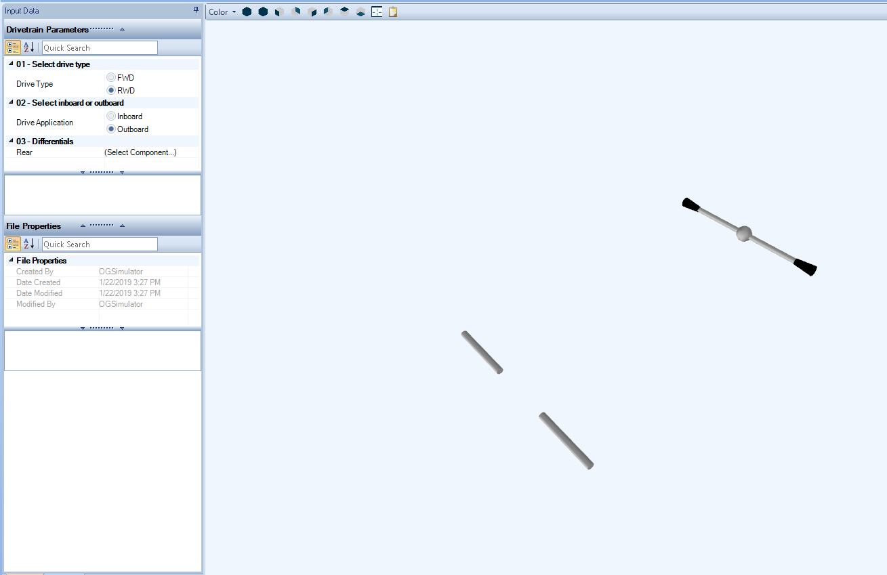

__Input Name__|__Description__
-|-
__Drive Type__|FWD – Front Wheel Drive: 100% of the drive torque goes to the front wheels RWD – Rear Wheel Drive: 100% of the drive torque goes to the rear wheels
__Drive Application__|Choose between having an inboard (CV Joint, as used in an independent suspension) or outboard drivetrain (as used in a solid rear axle)

#Combustion Engine

An engine can be added to the simulation model to study the effect of the throttle position the vehicle. The combustion engine is the simplest engine model you can create, and is defined by a set of engine speeds and engine torques at full throttle. This data is often determined from engine dyno testing.

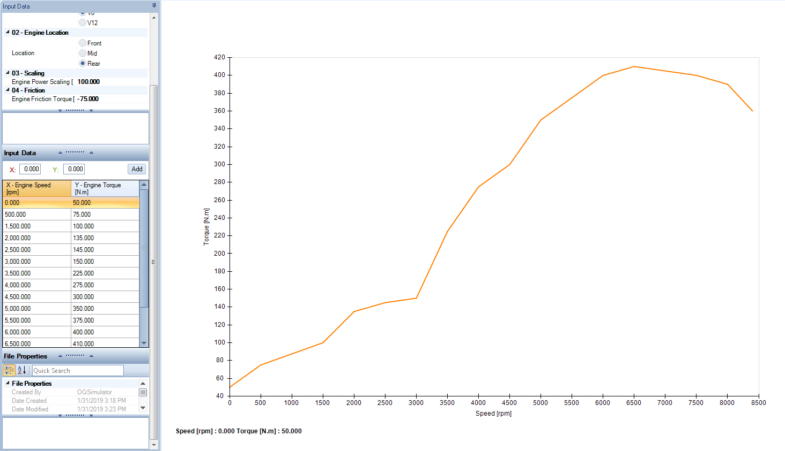

__Input Name__|__Description__
-|-
__Engine Power Scaling__|This scaling factor increases or decreases the power over the entire RPM range

#3D Engine Map

A 3D engine map is an engine torque map with respect to engine speed and throttle position. This data is often determined from engine dyno testing.

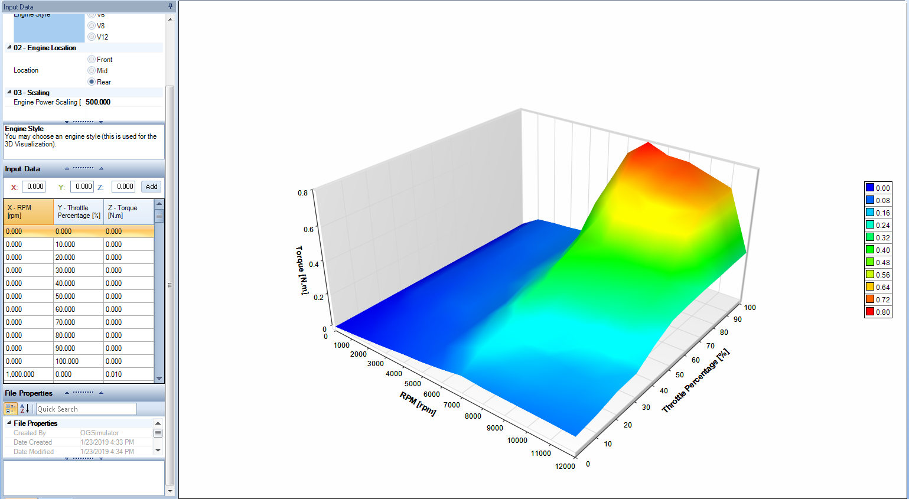

__Input Name__|__Description__
-|-
__Engine Style__|You may choose an engine style. (This is used for the 3D Visualization) 
__Location__|You can choose an engine location. (This is used for the 3D Visualization)
__Engine Power Scaling__|This scaling factor increases or decreases the power over the entire RPM range

To simplify the data input process, data for a torque curve can be imported into the software.  To do so, go to the engine button and select import.

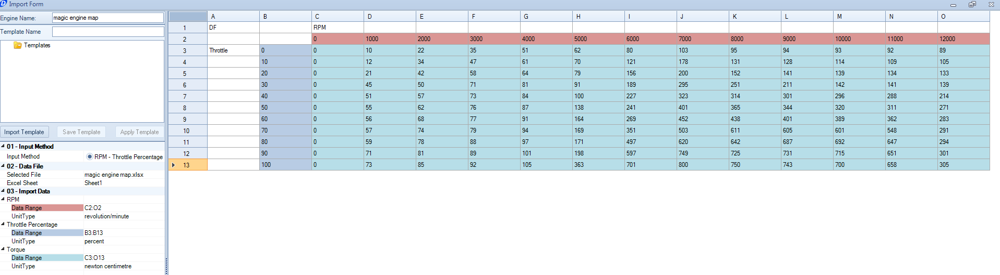

Within the import window, input the data sets that correspond to the throttle percentage, the RPM the engine was recorded at, and the resultant torque for a given RPM and throttle percentage.  Without any of the three parameters, OptimumDynamics cannot create the engine map.

#Constant Reduction Gearbox

The constant reduction gearbox lets you create a gearbox for engine that contains a series of fixed gear ratios, much like a sequential gearbox.  You can also define a final drive gear ratio that affects all the gears. If the vehicle is a single speed (e.g. an electric motor or a sprint car), just apply the final drive and a 1:1 ratio for the input data.  OptimumDynamics does not require a minimum number of gears to implement the gearbox.

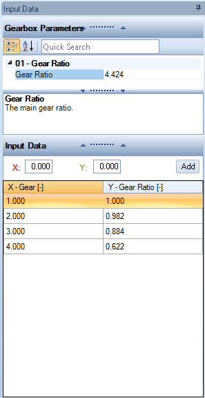

__Input Name__|__Description__
-|-
__Gear Ratio__|The main gear ratio 

#Simple Aerodynamics

The option to define the vehicle aerodynamics is possible in OptimumDynamics. This is important for most vehicles as it influences the top speed and the overall vehicle performance. A simple aerodynamics map is a system where the effects of ride height on the system are either unknown or can be considered negligible. For the simple aerodynamic model, the downforce and drag are calculated using the following formulae:

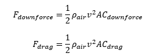

Where ρ_air is the density of air, v is the vehicle speed, A is the frontal area, C_downforce is the coefficient of downforce and C_drag is the drag coefficient. You will need to determine a value for the frontal area of your vehicle and the coefficients for drag and downforce. 

You can view the simple aerodynamic map in the adjacent window to determine if the values are correct. Also note that the aerodynamic balance includes the effect of both the downforce and drag forces. Therefore, when specifying downforce coefficients or downforce balance, remember that the load transfer effect of the drag is included in this value and is not calculated separately.

Note that the frontal area can also be used as any reference area or set to 1 provided that the coefficients are set with this assumption considered.

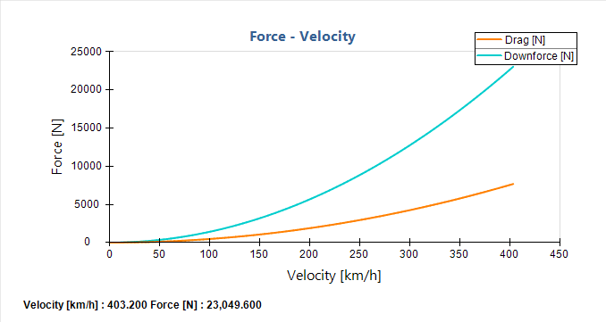

__Input Name__|__Description__
-|-
__Toggle Inputs__|You may choose to enter the information as either: *Downforce – Balance – Efficiency (DBE)* *Downforce – Drag – Balance (DDB)* *Front Downforce – Rear Downforce – Drag (FRD)*
__Density__|The density of air. The default value is 1.2255 kg/m3
__Frontal Area__|The frontal area of the vehicle. Alternately this is a reference area for the coefficients used.
__Downforce Coefficient [DDE or DDD selected]__|This value represents the downforce coefficient. A positive number results in downforce
__Downforce Balance Front [DDE or DDD selected]__|The percentage of the total downforce (including the effect of the drag force) that is reacted by the front axle
__Drag Efficiency [DDE or DDD selected]__|This is the percentage ratio of downforce over drag force
__Drag Coefficient [DDD or FRD selected]__|This value represents the drag coefficient. A positive value results in a drag force
__Front Downforce Coefficient [FRD selected]__|The downforce coefficient of the aerodynamics that is reacted by the front axle of the vehicle (including the effect of the drag force)
__Rear Downforce Coefficient [FRD selected]__|The downforce coefficient of the aerodynamics that is reacted by the rear axle of the vehicle (including the effect of the drag force)

#Aerodynamics Map

The vehicle aerodynamics can also be described by defining the downforce, drag and aerodynamic balance as a function of front and rear vehicle ride height. All three parameters should be entered for each combination of front and rear ride height. 

Offsets can also be defined for each of the parameters if required. This removes the need to adjust each data point individually or having to import a new dataset. The aeromap should be defined for the entire possible range of ride heights as values are not extrapolated in the simulation.

__Input Name__|__Description__
-|-
__Required Inputs__|This is how you change between viewing and entering data for downforce, drag and aerodynamic distribution.
__Air Density__|The density of air. The default value is 1.2255 kg/m3
__Frontal Area__|The frontal area of the vehicle. Alternately this is a reference area for the coefficients used.
__Offset Amount__|Offsets every data point by the given amount
__Offset Multiply__|Multiplies every data point by the given value.

You can view the aero map as a 3D surface plot. You can either do this from the ‘Input Data’ tab or from the ‘Output Data’ tab. By selecting the different checkboxes, you can easily visualize the resulting aero map from within OptimumDynamics.

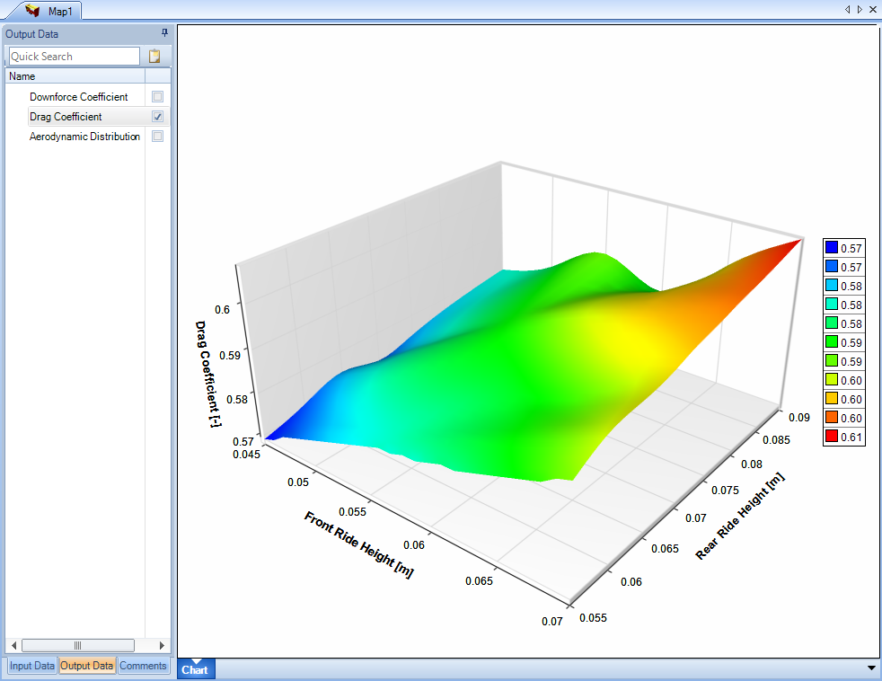

