The second stage of an OptimumDynamics project is simulation.  To reach this section, select the Simulation tab in the command ribbon or the project tree. In this section a vehicle setup is created based on the previously defined vehicle model. Input motions, forces and accelerations can be defined and/or imported from an Excel/CSV file. Once a vehicle setup and simulation input are defined then a simulation can be undertaken.

Certain simulation types require a full powertrain model containing an engine, gearbox and differential and/or a full tire model. The table below summarizes the component requirements for the simulation types.

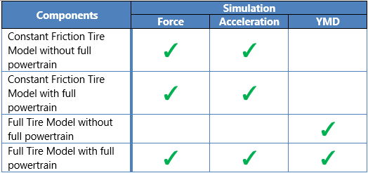

# Vehicle Setup

The vehicle setup allows you to combine the different components and assemblies that were previously defined into a single vehicle setup.  The following components must be defined in a vehicle setup. You must select a previously defined:
 
* __Chassis__

* __Brakes__

* __Front Suspension__

* __Rear Suspension__

* __Drivetrain__

You may also optionally define the following vehicle components:
 
* __Aerodynamics__

* __Engine__

* __Gearbox__
 
Additionally, a reference distance must be input for the vehicle.  The reference distance is the distance between the rear suspension plane and the front suspension plane. This is relative to the offset of the tire centerline to the suspension plane.  Below is an image explaining the measurements graphically. For a linear suspension the reference distance is simply the vehicle wheelbase. For a non-linear suspension the reference distance is the distance between the front and rear reference planes and is not necessarily the same value as the wheelbase.

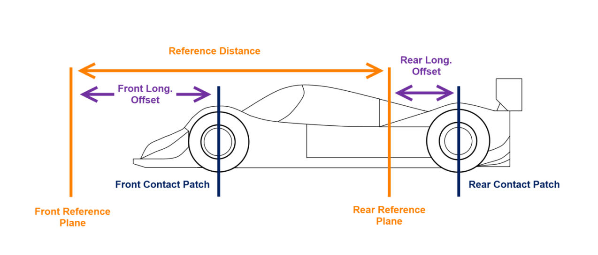

__Input Name__ | __Description__
- | -
__Reference Distance__ | This value represents the distance between the front suspension reference plane and the rear suspension reference plane. For a linear suspension it is equal to the wheelbase

Vehicle setups are defined from the components and assemblies in the project library. It is important to note that the components and assemblies defined in the library are not affected by changes in the components in the vehicle setup or vice versa. This is because the vehicle setups are not linked to actual components in the library; they are copied once on creation only. Once loaded, the vehicle setup will not automatically update.

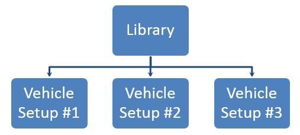

If you would like to distribute your vehicle into another project you can export the vehicle setup as a single file. The vehicle setup file contains all the component information inside it. The vehicle setup can be imported on its own into a project to do simulation and analysis. The below chart shows how the vehicle is described as a hierarchal structure made from sub-assemblies and components that were made as the vehicle design stage.

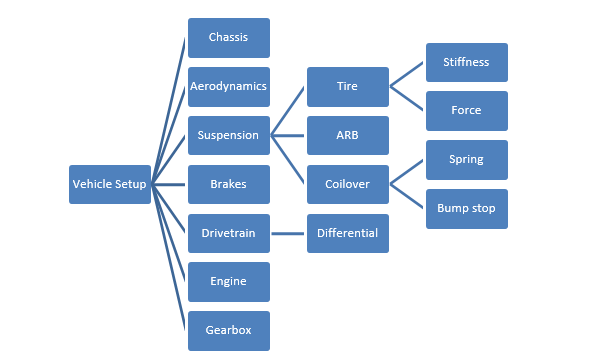

You can populate your vehicle setup by selecting the corresponding components from your library. The Quick Component Editor will appear and show you the compatible components from your library. You can edit components by double clicking on the component of interest. The component editor will be displayed in the visualization area.

You can also populate your vehicle setup through the vehicle diagram editor. From the vehicle diagram, you can easily drag and drop components from the component library into your vehicle setup.

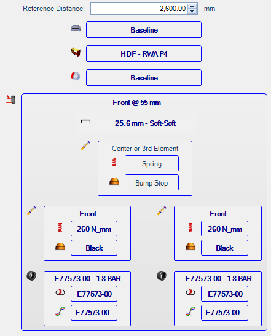

When you are done with the vehicle setup, you can validate your vehicle setup to ensure that the setup will successfully run a simulation. This can be done by clicking the ‘Validate Setup’ button in the component tree.  Validation of the car checks that the vehicle is physically possible by checking the kinematic model travel from full droop to full compression and then test steering from straight to full steering lock.  The vehicle is then put in a static state, only applying gravitational force to the vehicle.  If all validation converges, then the vehicle is ready to be put into simulation.

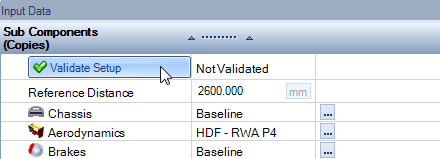

After a vehicle has been validated, initial parameters for the vehicle in static state can be found under the output data tab.  This allows the user to see how the vehicle is sitting based on the inputs determined by the user.  This is a good point to reference that the vehicle is sitting where actually desired.  Parameters can be searched from the top bar and certain pertinent values can be pinned within the right-hand pin button.

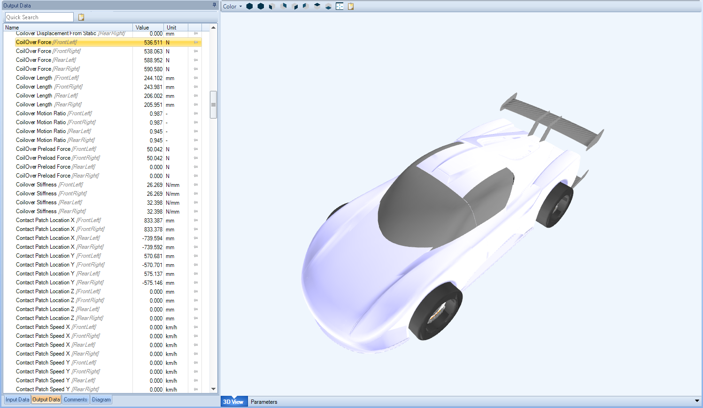

# Coordinate System and Simulation Input Definitions

The possible simulation inputs and their definitions are as follows:

__Input Name__ | __Description__
- | -
__Steering Wheel Angle__ | This is the steering wheel angle in the simulation. A POSITIVE value refers to a LEFT TURN.
__Velocity__ | This is the velocity of the vehicle in the simulation.
__Longitudinal Force__ | This is the total longitudinal force applied to the entire vehicle. A POSITIVE value refers to forward ACCELERATION.
__Lateral Force__ | This is the total lateral force applied to the entire vehicle. A POSITIVE value refers to a LEFT TURN.
__Vertical Force__ | This is the total vertical force applied to the entire vehicle.
__Longitudinal Acceleration__ | This is the requested longitudinal acceleration of the vehicle in the simulation. A POSITIVE value refers to forward ACCELERATION.
__Lateral Acceleration__ | This is the requested lateral acceleration of the vehicle in the simulation. A POSITIVE value refers to a LEFT TURN.
__Vertical Acceleration__ | This is the requested vertical acceleration of the vehicle in the simulation.

# Single State Force

The single state force type describes a simulation where a single force, steering wheel angle and vehicle velocity is specified.  This is valuable if there is a known goal lateral, longitudinal, or vertical force application that is intended to be analyzed.   The force is taken to act at the vehicle center of mass. 

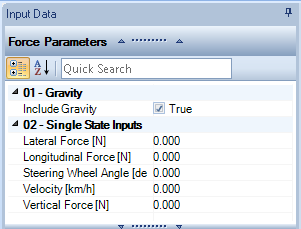

__Input Name__ | __Description__
- | -
__Include Gravity__ | When set to true the gravity is automatically added to the vertical force
__Longitudinal Force__ | This is the total longitudinal force applied to the entire vehicle. A POSITIVE value refers to forward ACCELERATION.
__Lateral Force__ | This is the total lateral force applied to the entire vehicle. A POSITIVE value refers to a LEFT TURN.
__Vertical Force__ | This is the total vertical force applied to the entire vehicle.
__Steering Wheel Angle__ | This is the steering wheel angle in the simulation. A POSITIVE value refers to a LEFT TURN.
__Velocity__ | This is the velocity of the vehicle in the simulation.

# Multiple State Force

This is similar to a single force input except that there are now multiple single state force steps defined in the simulation. The option to interpolate between the defined points using a cubic spline is also possible.  This can be particularly useful when investigating fundamental vehicle motions and comparing the instantaneous reaction to an input as created in the single point simulation to the overall reaction over a longer period.

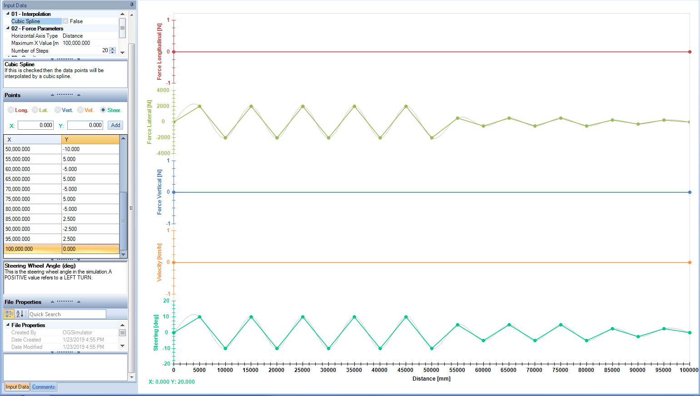

Points can also be added by clicking on the plot area. Click once to make the plot active. Click a second time and the data point will be added and can be adjusted to exact values in the data input area. The [X, Y] position is shown in the bottom left.

There is also the option to snap newly created points to the grid positions:

1.	Right Click inside the charting window
2.	Select ‘Snap to Grid’

It can also be helpful to overlay all the plots in a single chart. This can be achieved by

1.	Right Click inside the charting window
2.	Select ‘Axis Overlapped’

It is also possible to manually zoom in/out the y-axis of the plots using the mouse wheel.

__Input Name__ | __Description__
- | -
__Cubic Spline__ | If this is checked then the data points will be interpolated by a cubic spline
__Number of Steps__ | 	The number of simulation steps
__Horizontal Axis Type__ | The horizontal axis of the simulation plot, this can either be % of completion, distance or time. This is useful if you are playing back actual captured data.
__Include Gravity__ | When set to true the gravity is automatically added to the vertical force

# Single State Acceleration

The single acceleration type describes a simulation where a constant acceleration field is applied to the vehicle. Forces are calculated at the tire contact patch to achieve these accelerations. In addition to this the steering wheel angle and vehicle velocity are also specified. This is commonly used if there is a goal peak lateral or longitudinal acceleration that an engineer would like the vehicle to hit and vehicle behavior is desired for that given point (3G lateral, 4G bump, etc.).  The single acceleration is applied as a constant value at the center of gravity.

__Input Name__ | __Description__
- | -
__Include Gravity__ | When set to true the gravity is automatically added to the vertical acceleration
__Longitudinal Acceleration__ | This is the requested longitudinal acceleration of the vehicle in the simulation. A POSITIVE value refers to forward ACCELERATION.
__Lateral Acceleration__ | This is the requested lateral acceleration of the vehicle in the simulation. A POSITIVE value refers to a LEFT TURN.
__Vertical Acceleration__ | This is the requested vertical acceleration of the vehicle in the simulation.
__Steering Wheel Angle__ | This is the steering wheel angle in the simulation. A POSITIVE value refers to a LEFT TURN.
__Velocity__ | This is the velocity of the vehicle in the simulation.

# Multiple State Acceleration

This is similar to a single state acceleration input except that there is now multiple single state acceleration steps defined in the simulation. Acceleration inputs can be used in a similar fashion to the force, solving for the reactions of the vehicle under a given set of common inputs like would be done on a four-post rig.  In addition, if using the distance or the time parameter, the software can back calculate the distance and theoretical curvature of the inputs being applied to the vehicle.  Using this information, the software can create a representative track that displays the vehicle’s acceleration. The option to interpolate between the defined points using a cubic spline is also possible

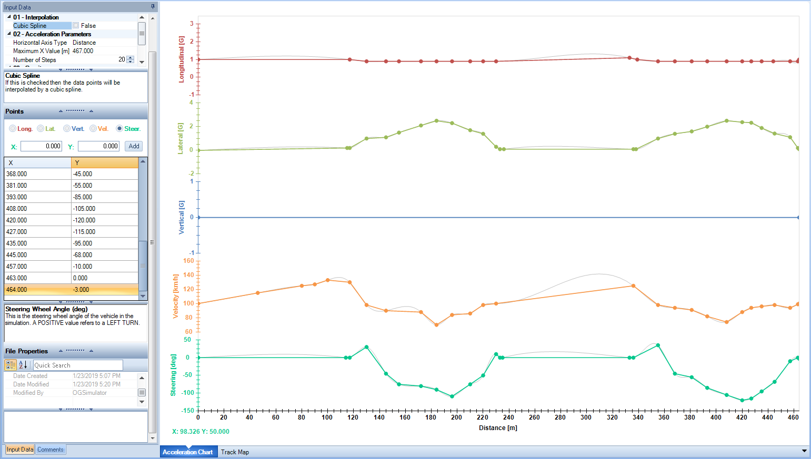

__Input Name__ | __Description__
__Cubic Spline__ | If this is checked then the data points will be interpolated by a cubic spline
__Number of Steps__ | This determines the total number of simulation steps
__Horizontal Axis Type__ | The horizontal axis of the simulation plot, this can either be % of completion, distance or time. This is useful if you are playing back actual captured data.
__Include Gravity__ | 	When set to true the gravity is automatically added to the vertical acceleration

#### *Importing Track Playback*

Using six common data inputs for a vehicle, OptimumDynamics can playback a vehicle lap. The software can import either a .csv or an .xls file.  The .csv file is the recommended format as it is usually faster to import than an .xls file. The software requires inputs for:
 
* Lateral Acceleration
* Longitudinal Acceleration
* Vertical Acceleration
* Steering angle
* Velocity
* Time
 
Using the inputs, the software can calculate to find the position of the vehicle, the slip angles, and the throttle and brake positions that would result in the vehicle having the acceleration and velocity in the input.

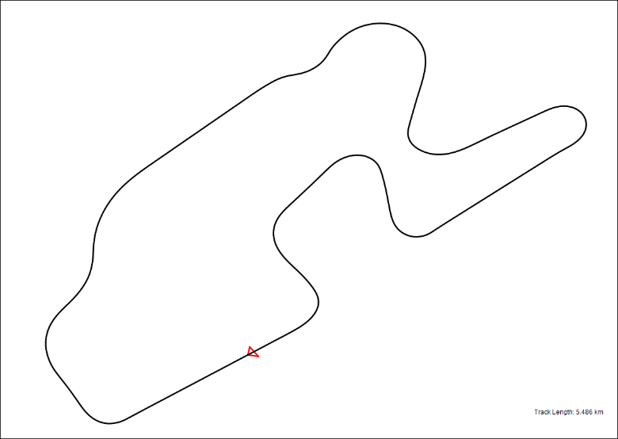
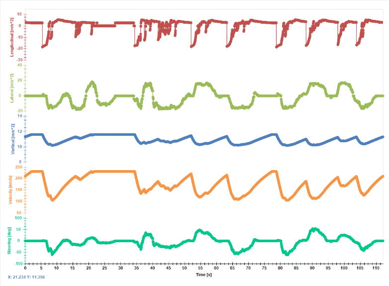

OptimumDynamics can read data from any data logger that can export data to an Excel compatible file or to a CSV file format.  As such, vehicle data can be processed from any vehicle running the following data logging systems:
 
•	Motec/I2
•	Bosch/Windarab
•	Magnetti Marelli/Wintax
•	AEM data logging
•	McLaren/ATLAS
•	Racepak
•	AIM Data Logging
 
Most other data analysis software can also be used.  To create the logged file, crop the data desired from the logged file and export the data to a file that can be converted to a .csv file or an .xls file if a .csv is not possible.  To get the most out of the track playback feature, use only one lap to minimize simulation time an increase the accuracy of the simulation.  The software also requires that the time stamp for the initial point begins at zero.  If taking data from a larger file, overwrite the time stamp provided by the data logger and increment by the same value exported starting from 0.  When finished, export the data to an Excel file or a CSV file format.

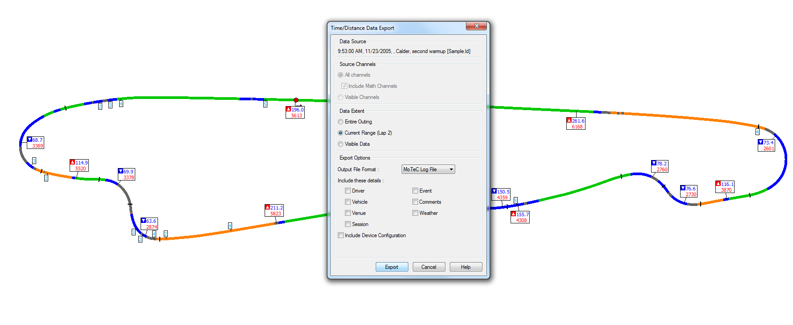

Once the data is exported to a compatible file, select the import button under the acceleration tab to import the data. After selecting the file, select the data that correlates with each required input listed above. The data can be selected by either double clicking on the column   that corresponds to the data, by clicking and dragging on the data desired, or by the key sequence Ctrl + Shift + Down Arrow. If there is more data within the file that is not being used (such as a file header, double clicking on the row will incorporate those values too. If this is the preferred import method, delete the excess points before importing the data to OptimumDynamics. 

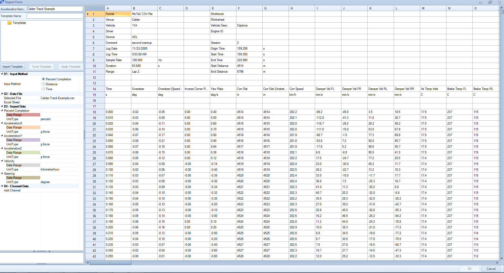

Additional inputs can be added that can be used for validation of the simulations by selecting the add channel button on the left-hand side of the window. The channels added at this point can be accessed in the post processing tools for any of the simulations using this input file.  

If the format for the input data is carried over for several files, a __template__ can be created for the software.  To create a template, start by typing a name for the template in the top text box.  Select the rows and columns from the file, and select the save template button.  A prompt will come up asking to adjust the row count depending on the size of the file input.  The software will now automatically select the columns for each input if the template is selected.

Once the data for the inputs are selected, click okay and OptimumDynamics will create a multiple state acceleration  input file. To see the generated  course, click on the __Track Map__ tab on the bottom of the __Document Manager__. By default, the track will be an open loop. It can be closed by selecting the __Close Track__ option along the top of the __Document Manager__. 

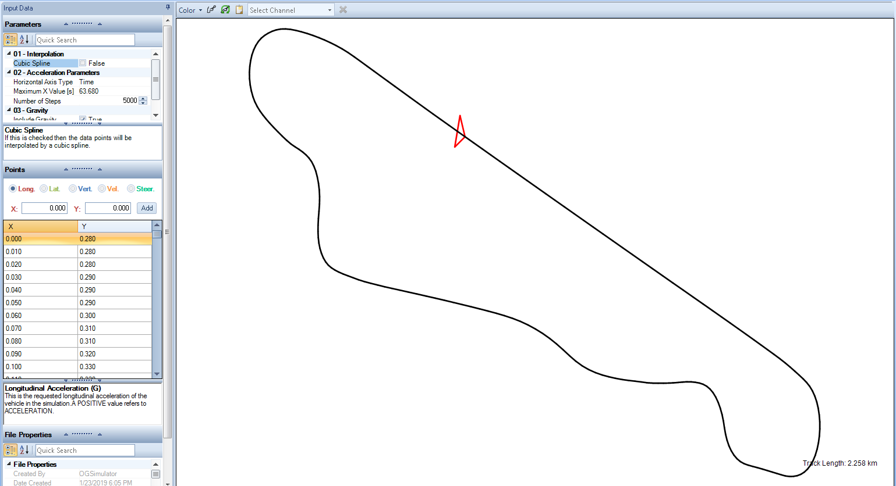

To improve simulation time, the step size can be shortened in the input portion of the __Document Manager__.  OptimumDynamics will automatically simplify the steps to best represent the motion of the vehicle.  Reducing the step size does remove some of the accuracy of the measured, but for most instances a step size under 500 will be a good compromise of simulation time and accuracy.

# Introduction to Yaw Moment Diagrams

The yaw moment diagram is a powerful analysis tool that can show you the grip, balance, control and stability of your vehicle. The purpose of the analysis is to study the forces and moments acting upon the vehicle body while the vehicle is subjected to a range of steering angles and chassis side slip angles. This lets you understand the forces and moments acting on the car within its operating range.

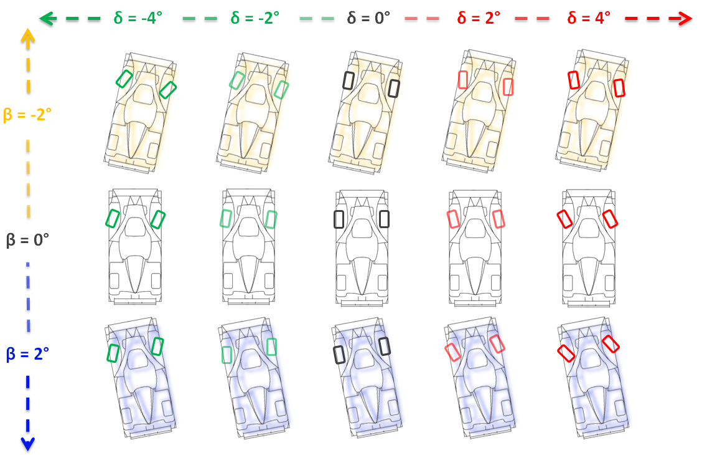

The force and moment data generated from the simulation is visualized on a carpet plot of yaw moment versus lateral acceleration, with each iso-line representing a line of constant steering angle or a line of constant chassis slip angle.

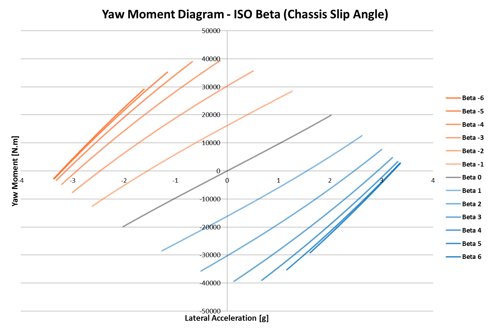
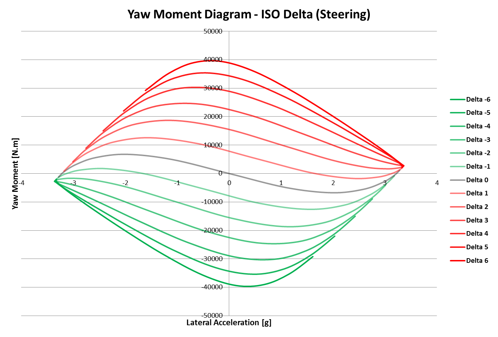

Four major metrics can be extracted from the diagram: control, stability, balance and grip.

__Vehicle Control__ is defined as the amount of yaw moment per degree of steering. This represents the amount of directional control available to the driver to rotate the car. This metric can be calculated at every point in the yaw moment diagram; however, most useful is to observe the control at the corner entry (when the chassis side slip angle and steering angle is zero) and near the limit (when maximum lateral acceleration is achieved).

__Vehicle Stability__ is defined as the amount of yaw moment per degree of chassis slip angle. This represents the ability of the car to provide a restoring yaw moment when the chassis side slip angle is disturbed. This metric can be calculated at every point in the yaw moment diagram; however, most useful is to observe the stability at the corner entry (when the chassis side slip angle and steering angle is zero) and near the limit (when maximum lateral acceleration is achieved).

__Grip__ is represented by the maximum lateral acceleration capability of the vehicle. This metric is indicative of the cornering potential of the vehicle.

__Balance__ is represented by the amount of yaw moment at maximum lateral acceleration. This quantity is called the residual yaw moment. The presence of a residual yaw moment at maximum lateral acceleration indicates there is over or understeer at the limit.

OptimumDynamics makes it easy to generate these diagrams and to study the influence of the vehicle setup on these metrics. Every point on the yaw moment diagram is a solution to the vehicle state, so you can observe other output channels in addition to the metrics.

# Constant Step YMD

The constant step YMD simulation allows you to easily generate these diagrams with your OptimumDynamics vehicle model. The constant step YMD sweeps of vehicle inputs in constant increments and calculates the resulting yaw moment and lateral acceleration. Using a full simulation allows the user to see the limit conditions of the vehicle along with the initial and intermediary behaviors of the vehicle.

__Input Name__ | __Description__
- | -
__Input Type__ | 	Constant Speed – The vehicle speed is fixed Constant Radius – The corner radius is fixed
__Max__ | This value represents the maximum value for the step sequence
__Min__ | This value represents the minimum value for the step sequence
__Steps__ | This value represents the number of steps between minimum and maximum values
__Beta Inputs__ | This section represents the maximum chassis slip angle allowed for the simulation (difference between steering input and the direction of the vehicle x component)
__Delta Inputs__ | This section represents the maximum angle for the steering wheel input that is allowed in the simulation
__Velocity Inputs [Constant Speed Selected]__ | This section represents the vehicle velocity the simulation will be completed at.  From the velocity selected, the corner radius can be derived.
__Radius Inputs [Constant Radius Selected]__ | The arc the vehicle will move around if the velocity is not fixed.  From the radius selected, the velocity required to complete the arc is derived.
__Longitudinal Acceleration__ | The net acceleration vector for the vehicle at the limit investigated *Coasting*: The vehicle has no supplemental inputs for lateral acceleration for the vehicle *Engine Braking*: No driver inputs are added, but the vehicle will slow based on the inputs for the engine and transmission *Fixed Longitudinal Acceleration*: The car will move per a fixed acceleration.  Driver inputs for acceleration and braking will then be created

# Single State YMD

The single state YMD calculates the vehicle state depending on the desired state. You can solve for the turn limit when the maximum lateral acceleration or the neutral limit to find the maximum lateral acceleration when the yaw moment is zero. You can simulate with a custom set of YMD inputs by selecting the custom condition. This input can especially useful if performing a sensitivity analysis of the vehicle.

__Input Name__ | __Description__
- | -
__Input Type__ | *Constant Speed* – The vehicle speed is fixed *Constant Radius* – The corner radius is fixed
__Condition__ | *Right Turn Limit* – Solve for the right turn limit *Right Turn Neutral Limit* – Solve for the right turn neutral limit *Left Turn Limit* – Solve for the left turn limit *Left Turn Neutral Limit* – Solve for the left turn neutral limit *Custom* – Solve using the input data
__Beta__ | This value represents the beta value
__Delta__ | This value represents the delta value
__Radius__ | This value represents the radius value
__Velocity__ | This value represents the velocity value

# Quick Run

Clicking on this button allows you to run a quick run simulation without having to define a simulation beforehand. You need to select a vehicle setup and an input motion, force or acceleration. You also need to input a name for the result file and a location to save it.

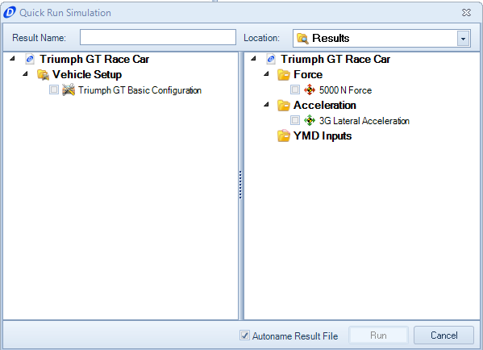

The Quick Run feature is perfect for getting to analysis in a hurry. If you plan on running the same simulation multiple times, it would be beneficial to create an actual simulation file.

The Quick Run feature also allows you to select multiple vehicle setups and/or simulations. By selecting multiple inputs OptimumDynamics will perform a simulation for each combination and a result file will be generated with the vehicle and simulation name for that combination. 

# Simulation

You can define a simulation to run. A simulation requires that an input type and a corresponding input file be selected. The simulation definition also requires a vehicle setup that will be used in the simulation.

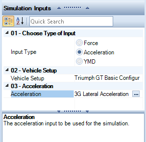

__Input Name__ | __Description__
- | -
__Input Type__ | The type of simulation that will be run
__Vehicle Setup__ | The vehicle setup to be used in the simulation
__Force__ [Force Toggled] | The force input to be used for the simulation
__Acceleration__ [Acceleration Toggled] | The acceleration input to be used for the simulation
__YMD__ [YMD Toggled] | The YMD input to be used for the simulation

# Run

Clicking on this button will run a simulation. You must select a previously defined simulation to run and a location and name for the corresponding result file. When running the simulation, a progress bar shows the completion of the simulation. A simulation can be cancelled or stopped at any time. Once the simulation has finished OptimumDynamics will automatically show the Results Tab in the __Document Manager__.

# Batch Simulation

The batch simulation lets you to easily run different combinations of components or vehicle parameters. This allows you to easily run many simulations and study the influence of different components or different ranges of parameters on the vehicle. The batch simulation document is composed of three sections: input data, parameter selection and iteration editor.

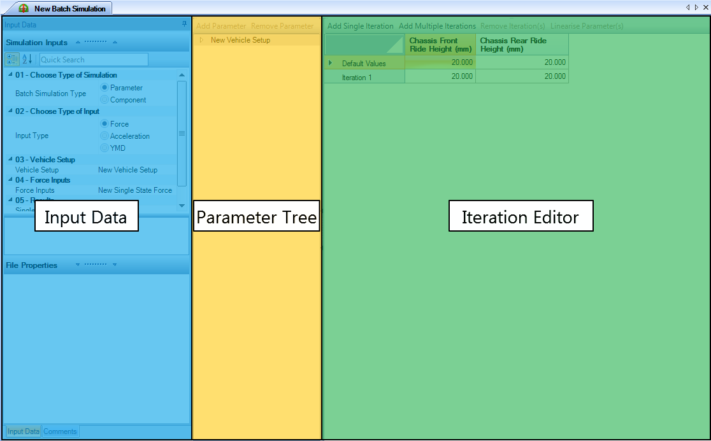

To set up a batch simulation, first select the type of batch simulation, simulation options and the vehicle model you would like to base your batch simulation.

__Input Name__ | __Description__
- | -
__Batch Simulation Type__ | The type of simulation that will be run
__Vehicle Setup__ | The vehicle setup to be used in the simulation
__Force__ [Force Toggled] | The force input to be used for the simulation
__Acceleration__ [Acceleration Toggled] | The acceleration input to be used for the simulation
__YMD__ [YMD Toggled] | The YMD input to be used for the simulation
__Single File__ | If selected, a single file will be generated for all the iterations. Otherwise, a result file will be generated for the individual iterations.

To add parameters to your batch run, navigate the parameter tree and select the parameter you want to add. Depending on what the batch simulation type selected, you will either be able to select parameter values or components from the parameter tree. A new column with the selected parameter will be added to the iteration editor.  The component batch can be especially useful when comparing purchased parts that have known parameters or when comparing two different vehicles.  There is no maximum number of components or configurations.

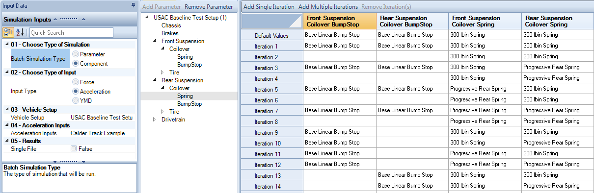

A parameter batch simulation functions in a similar way to the component batch simulation but expands on the possibilities of what can be modified.  Parameter batch simulations are especially good for sensitivity analysis and understanding what components affect the vehicle the greatest. Each component in the parameter batch can be modified to the thousandths place for maximum accuracy and sensitivity understanding.

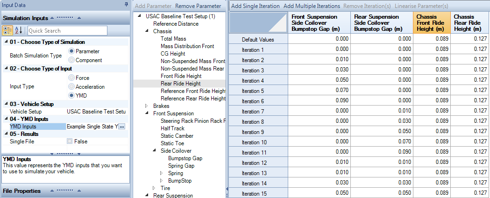

The iteration editor is a table that shows the combination of parameters for the individual iterations. Here you can add and remove iterations from your batch run. Iterations can be modified by directly editing the cells in the table. For parameter type batch simulations, selecting a column will enable the linearize parameter(s) option. This automatically generates equally spaced values between first and last iterations.

# Two Parameter Study

The influence of two vehicle parameters can be studied simultaneously in the two-parameter study. You can define the two parameters to vary, the minimum and maximum values, and the number of simulation steps.

__Input Name__ | __Description__
- | -
__Input Type__ | The type of simulation that will be run
__Vehicle Setup__ | The vehicle setup to be used in the simulation
__Force Inputs__ [Force Toggled] | The force input to be used for the simulation
__Acceleration Inputs__ [Acceleration Toggled] | The acceleration input to be used for the simulation
__YMD Inputs__ [YMD Toggled] | The YMD input to be used for the simulation
__Parameter 1__ | This is the name of the first parameter
__Parameter 1 Minimum Value__ | This is the minimum value of the first parameter
__Parameter 1 Maximum Value__ | This is the maximum value of the first parameter
__Parameter 1 Number of Steps__ | This is the number of simulation steps
__Parameter 2__ | This is the name of the second parameter
__Parameter 2 Minimum Value__ | This is the minimum value of the second parameter
__Parameter 2 Maximum Value__ | This is the maximum value of the second parameter
__Parameter 2 Number of Steps__ | This is the number of simulation steps
