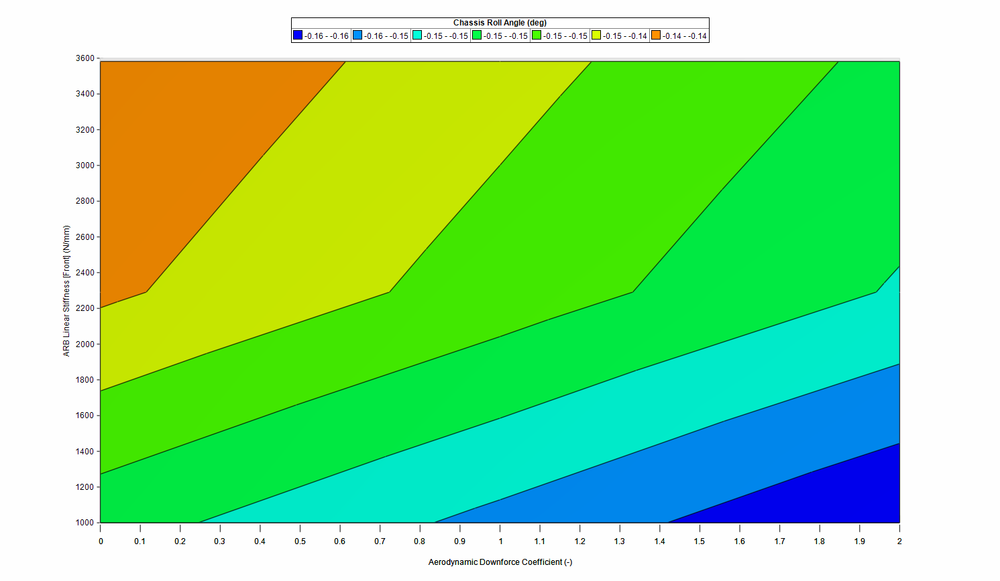

# Introduction

The analysis section of a project provides useful evaluation and visualization tools for analyzing the results of a simulation. Using these tools, you can investigate all output variables that are calculated during the simulation. The following topics are presented in this section

# Result

After a simulation is completed, a result file is created. A preview of the result file can be immediately seen in the Document Manager either in table or chart format. The selected channel or channels that are displayed in the preview table or chart is a global setting and will be common for all result files in the project.

For YMD type simulations, there is an additional graph that shows the yaw moment versus the lateral acceleration. Selecting a channel will color each point in the graph by the value of the selected channel.

For Two-Parameter type simulations, there are two additional graphs available: two-parameter study chart and two-parameter study table. The two-parameter study chart allows you to plot a channel against the two parameters used in the study. This chart can be shown as a 3D surface or as a 2D contour plot. The two-parameter study table shows you a table of channel values versus the two parameters used in the study.

By clicking on the result tab in the ribbon bar, result files from other projects can be imported or result files in the current project can be exported. Results can also be exported to an excel CSV file.

# 2D Chart

2D charts allow the graphical plotting of two variables and their relationship to each other. Multiple results can be plotted on one chart, and a secondary axis can also be implemented. Charts are fully customizable using the buttons on the __Ribbon Control Bar__ or by clicking inside the __Report Chart__ area.

To create a 2D chart:

1.	Click the Analysis section
2.	In the ribbon go to the Charts group and select __Create__ > Select __2D Chart__
3.	Enter a name and choose a location for the resulting file

The chart series editor should now be visible. The following options are available in the chart series editor for describing the 2D chart. You may also get to the series editor by right clicking in the __Report Chart__ area or by selecting the data option from the ribbon menu.

__Series Options__ | __Description__
- | -
__Name__ | This is the name of the series. This can be left as the default name or it can be given a user defined name by checking the Overrides box.
__Horizontal__ | Select what variable is displayed on the horizontal axis. You can also choose whether this should be displayed on the first or secondary axis
__Vertical__ | Select what variable is displayed on the vertical axis. You can also choose whether this should be displayed on the first or secondary axis
__Result__ | Select what result files the series will be plotted for. Each additional result file selected will be another series on the chart
__Line__ | Define the line size, color and type connecting the data points. This can be checked on or off.
__Marker__ | Define the marker size, color and shape of each data point. This can be checked on or off
__Gradient Color__ | Gradient color allows you to color a data series based on another output variable. This allows even more information to be displayed on a 2D chart.
__Trendline__ | A Trend-line can be linear or polynomial of the defined order. The R-Squared value can be displayed and is a measure of how well the trendline fits the data. The trendline equation can also be displayed on the chart.

If a chart contains multiple series, it is possible to plot channels against a secondary axis. When graphing a single selected result – the graphed color will be the color selected under ‘line options’, when multiple results are graphed on the same chart, the graphed color will be that of the color nominated under the results Project Tree.

Each chart can display results from multiple simulation runs. The selected results can be chosen via the __Chart Series__ editor, via the Data menu option (on the __Ribbon Control Bar__) or by right clicking on the chart.  Axis, Title and Legend options are accessible from the __Ribbon Control Bar__.

__Series Options__ | __Description__
- | -
__Data__ | You can open the series editor from here, add an extra result file to the data or they can clear all result files from the chart.
__Title__ | Select a title font, style, size, color and location by selecting title options
__Legend__ | Choose a location for the legend to display. The legend can also be manually moved by hand
__Primary Horizontal Axis__ | Choose a name, font, style, size and color for the axis. It is also possible to specify the gridline options here.
__Primary Vertical Axis__ | Same as the primary horizontal axis except option refer to the primary vertical axis
__Tools__ | Enable/Disable the chart zoom and cursor.
__Copy to Clipboard__ | Copy an image of the chart to the clipboard. This can then be pasted into another document or program such as MSWord.
__Copy Data to Clipboard__ | Copies the series names and [X, Y] locations to the clipboard. This can then be pasted into a separate document/program such as MSExcel.
__Save as Picture__ | Saves the chart as an image with the given name and file type. File formats supported are PNG, JPG, GIF, BMP

An area of the chart can be zoomed in on by clicking and holding the left mouse button down and selecting an area of interest. Note that, you need to click and drag down and to the right to zoom. If you drag in any of the other directions, you will zoom out. You will notice that a blue square indicates zoom in and a red square indicates zoom out.

The X, Y locations of points of interest can be determined by enabling the __Cursor__ option from the tools menu (accessed by right-clicking in the chart area). Simply place the cursor over the interested point and the coordinates will be displayed in the bottom left of the chart area. Note that the values are referring to the primary axis only.

You can view the simulation output of an iteration by selecting a point on the chart. You can select a data point by double-clicking on a data marker in the chart area. The selected data point will be indicated with a red data marker. You can view the output data for that data point in the Output Data pane, located on the right of the chart.

Charts are useful for visualizing the overall trends and behavior of important parameters during a simulation. This behavior can be easily compared with other result files by visual inspection.

# YMD Chart

The YMD Chart is a specialized chart that plots the yaw moment versus the lateral acceleration. This chart is typically used for constant step YMD type simulation. However, you may choose to use this chart for other types of simulations.

To create a YMD chart:

1.	Click the __Analysis__ section
2.	In the ribbon go to the __Charts__ group and select Create > Select __YMD Chart__
3.	Enter a name and choose a location for the resulting file

The chart series editor should now be visible. The following options are available for describing the YMD chart. You may also get to the series editor by right clicking in the __Report Chart__ area or by selecting the data option from the ribbon menu.

__Series Options__ | __Description__
- | -
__Name__ | This is the name of the series. This can be left as the default name or it can be given a user defined name by checking the Overrides box.
__Connect Lines with same: Steered Angle (Delta)__ | This option when selected draws isolines between points of constant steering angle.
__Connect Lines with same: Chassis Slip Angle (Beta)__ | 	This option when selected draws isolines between points of constant chassis slip angle.
__Only Show Converged Steps__ | This option when selected will not plot iterations that did not converge.
__Result__ | Select what result files the series will be plotted for. Each additional result file selected will be another series on the chart
__Line__ | Define the line size, color and type connecting the data points. This can be checked on or off.
__Marker__ | Define the marker size, color and shape of each data point. This can be checked on or off
__Gradient Color__ | Gradient color allows you to color a data series based on another output variable. This allows even more information to be displayed on a 2D chart.

You can view the simulation output of a simulation iteration by selecting a point on the chart. You can select a data point by double-clicking on a data marker in the chart area. The selected data point will be indicated with a red data marker. You can view the output data for that data point in the Output Data pane, located on the right of the chart.

The YMD Chart can be customized by either using the ribbon bar with the Charts buttons, or by using the context menu when you right click in the plotting area. The chart title, axis and legends can be customized in the same way as the 2D Chart.

# Comparison Chart

The comparison chart is specialized chart that lets you compare the results of multiple single state simulations. You can use this chart to understand parameter sensitivities.

To create a comparison chart:

1.	Click the __Analysis__ section
2.	In the ribbon go to the __Charts__ group and select __Create__ > Select __Comparison Chart__
3.	Enter a name and choose a location for the resulting file

The chart series editor should now be visible. In the chart series editor, you select any __single state__ simulation you wish to compare. The following options are available for describing the comparison chart. You may also get to the series editor by right clicking in the __Report Chart__ area or by selecting the data option from the ribbon menu.

__Series Options__ | __Description__
- | -
__Name__ | This is the name of the series. This can be left as the default name or it can be given a user defined name by checking the Overrides box.
__Output Channel__ | Select what variable is displayed on the vertical axis. You can also choose whether this should be displayed on the first or secondary axis
__Result__ | Select what result files the series will be plotted for. Each additional result file selected will be column in the comparison chart.
__Line__ | When selected, the comparison chart will show a line chart. Define the line size and type connecting the data points.
__Bar__ | When selected, the comparison chart will show a bar chart. You can also select the bar shape.
__Override Color__ | When selected, it will make all bars and markers the selected color.
__Show relative change from Baseline Result__ | When selected, it will plot the relative difference in the output channel to a baseline result. *Baseline Result* – Selects the reference result that the relative difference will be calculated. *Variation Unit* – Changes the units of the relative results on the vertical axis. You can choose either Ratio or Percentage.

The comparison chart can show either a line chart or a bar chart. You can select the type of chart by selecting either the Line or Bar option in the chart series editor. To aid in visualization, the comparison chart has the option to sort the columns.

The comparison chart can be customized by either using the ribbon bar with the Charts buttons, or by using the context menu when you right click in the plotting area. The chart title, axis and legends can be customized in the same way as the 2D Chart.

# Contour Chart

Contour charts are primarily used to compare a spectrum of data, usually based on a two-parameter study analysis.  They can show the sensitivity of the vehicle across a spectrum of adjustments and allow a relationship to be set between two outputs of the vehicle.

To create a contour chart, select the Contour Chart option under the Command Ribbon.  After naming the file and selecting a location, the software will bring up the contour plot editor. 

Within the editor, select the two parameters to compare, and the gradient at which they are being analyzed.  Options are available to increase or decrease the number of gradient levels.  Once the data is set, select OK and the software will generate the plot.  The same options for all 2D plots are available from both a right click on the plot area or by selecting the option in the Charts section of the Command Ribbon

# Table

Report Tables allow the tabular display of multiple channels across multiple runs next to each other. Channels for display are chosen through the __Reports Input Data__ pane and results are chosen through the Results Input Data pane. Table data can be readily copied to the clipboard (Ctrl + C) for further analysis in external programs if required.

Selecting a channel and a simulation result will display the information in the __Document Manager__. Values for each result will be displayed for each selected channel.

The values shown in a table report can be readily copied to the clipboard, for further processing in Excel or MATLAB®.

Tables are useful for investigating the exact values of parameters during a simulation. The values can be easily compared against other result files by looking across the table row.

Adding a table will allow you to see the numerical values at each step in the simulation. Tables also include the following calculated values:

__Series Options__ | __Description__
- | -
__Maximum Value__ | The maximum value in the column of data
__Minimum Value__ | The minimum value in the column of data
__Average Value__ | The average value in the column of data
__Start Value__ | The first value in the column of data
__End Value__ | The final value in the column of data
__Maximum Absolute Value__ | The maximum absolute value in the column of data

# Track Map

One of the most useful visualization tools OptimumDynamics offers is the track map. In the track map you can easily see what the vehicle is doing at different positions during the simulation. Track maps become even more useful when you plot the same track for a different simulation. The result is offset from the track and it is easy to see the changes that have occurred.

To create a track map:

1.	Click the __Analysis__ section
2.	In the ribbon go to the __Track Maps__ group and select Create
3.	Enter a name for the report and select a location to save
4.	Select the result file/s to plot and a variable to color the map by

It is important to note that certain requirements must be fulfilled before a result file can be turned into a track map. The simulation/ result file must have the following channels:

* Distance or time
* Lateral acceleration
* Longitudinal acceleration
* Velocity

Without these channels a track map cannot be created. Specifically, simulations that have been defined as a percentage of simulation completion cannot have track maps generated.
One more important thing to note is that only results that have been run on the same simulation can be overlaid. You cannot have two different tracks displayed at the same time. You will notice that when one result is selected the other non-valid ones will become greyed out. This is to indicate that they are not compatible with the selected result file.

# Math Channels

Math channels allow you manipulate existing signals to create new channels. You can use this feature to perform advanced analysis or to create channels that are not by default available in OptimumDynamics.

To create a math channel, go to the Analysis tab in the ribbon and click the ‘Create’ button in the Math section. After naming your channels, the Math Channel Editor will appear. The Math Channel Editor has four sections: Math Channels, Channel Properties, Channel Equations and Channels.

The __Math Channels__ section allows you manage your math channels. You can add, remove or re-order your channels by using the buttons at the top of the list.

The __Channels Properties__ section lets you define the name, the type of measurement and the unit of measurement of the selected channel.

The __Channels Equation__ section is where you define the equation to describe your channel. Existing channels are evaluated in single quotation marks (‘’). Channels that evaluate properly are syntax highlighted in green. Basic math operators are supported for addition (+), subtraction (-), multiplication (*) and division (/). You may also use any supported function in the expression editor.

Information about errors is detailed in the help section. When OptimumDynamics is not able to evaluate the expression, the help text will change to show where the error occurred. When a channel cannot be evaluated, the expression editor will highlight the channel in red.

The __Channels__ section contains a list of available channels and functions that you can use in your expression. To add a channel or function to your expression, double click the desired selection from either the channel list or function list.
Math channels can be used in charts and in track maps.

