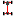

---
titleHot Keys and File Types
---
# File Names

__Icon__ |  __Name__ |  __Extension__
- |  - |  -
| Project File| .ODPro
| Aero File| .ODAer
| ARB File| .ODArb
| Brake File| .ODBra
| Bump Stop File| .ODBum
| Chassis File| .ODCha
| Coilover File| .ODSpa
| Differential File| .ODDif
| Drivetrain File| .ODDri
| Gearbox File| .ODGea
| Engine File| .ODEng
| Spring File| .ODSpr
| Suspension File| .ODSus
| Tire Force File| .ODTfo
| Tire Stiffness File| .ODTst
| Tire File| .ODTir
| Torsion Bar File| .ODTor

__Icon__ |  __Name__ |  __Extension__
- |  - |  -
 |  Vehicle Setup File |  .ODVeh
 |  Force File |  .ODFor
 |  Acceleration File |  .ODAcc
 |  Simulation File |  .ODSim
 |  YMD File |  .ODYmi

__Icon__ |  __Name__ |  __Extension__
- |  - |  -
 |  Result File |  .ODRes
 |  Chart2D File |  .OD2dc
 |  Table File |  .ODTab
 |  Track Map File |  .ODCtm
 |  Math Channel File |  .ODMch
 |  Worksheet File |  .ODWks
 |  YMD Chart File |  .ODYmc

# Hotkeys

__General Hot Keys__  |   -
-  |   -
__Ctrl + C__ | Copy Object	
__Ctrl + N__ | New	
__Ctrl + O__ | Open	
__Ctrl + S__ | Save	
__Ctrl + Shift + S__ |  Save As Project	
__Ctrl + V__ |  Paste Object	
__Ctrl + W__ |  Close	
__Ctrl + X__ |  Cut Object	
__Alt + A__ |  Analysis	
__Alt + F__ |  File		
__Alt + L__ |  New Linear Tire Stiffness		
__F1__ |  Help
__F2__ |  Bug Reporting
__F4__ |  Quick Run Simulation
__F5__ |  New Simulation
__F9__ |  Options
__Mouse Wheel__ |  Zoom
__Right Mouse Click__ |  Pan
__Left Mouse Click__ |  Rotate
__Delete__ |  Delete Object
__Simulation Specific__ |  
__Left Click__ |  Add simulation point
__Scroll__ |  Zoom y-axis
__Suspension Specific__ |  	
__Double Left Click__ |  Edit Point	 
__Ctrl + Click__ |  Move Point

