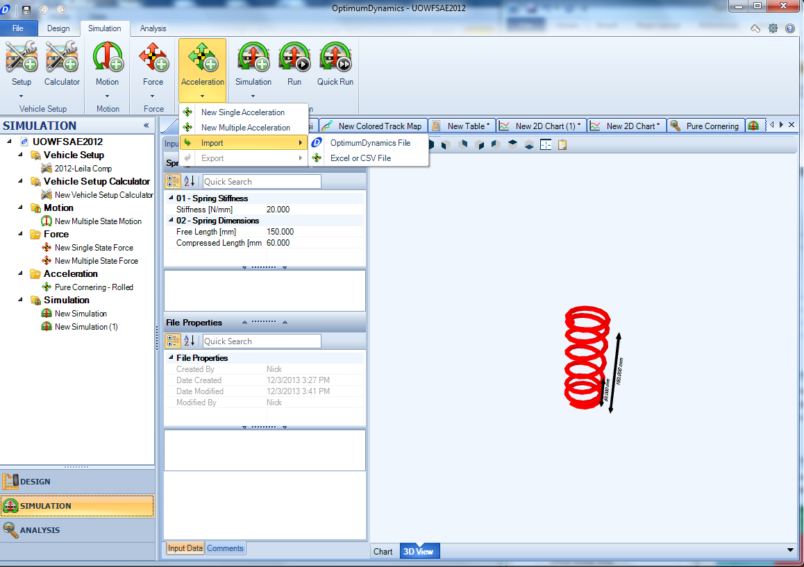
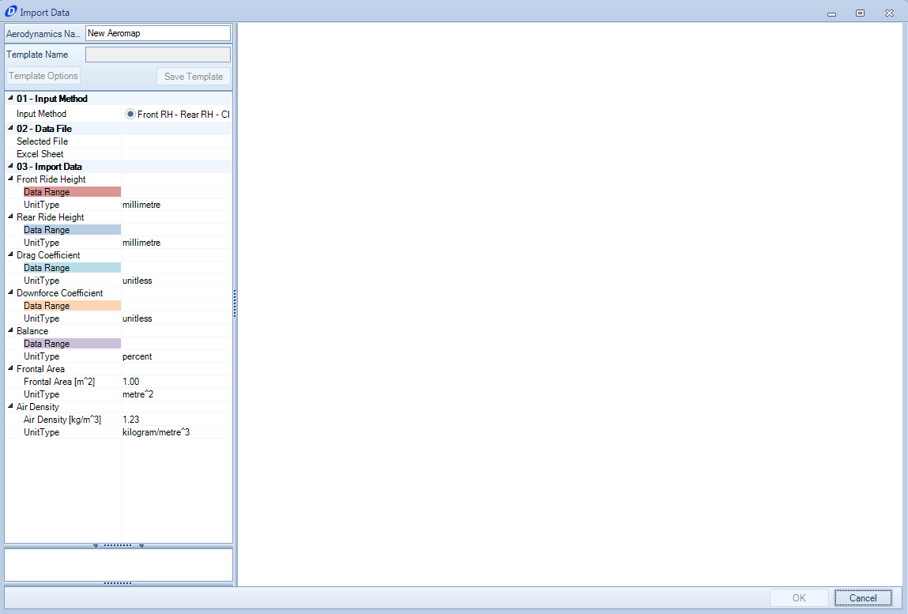
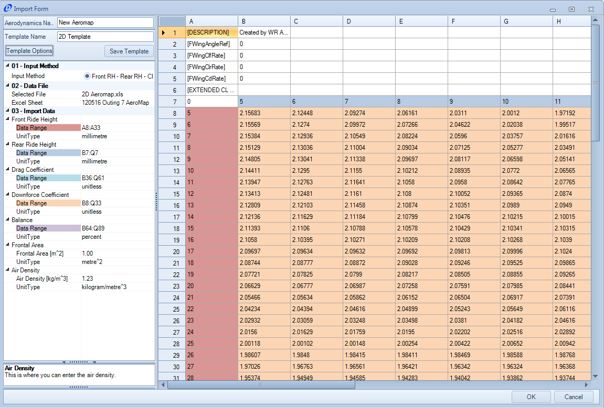

#Importing and Exporting Data

Use the Import and Export features to save and reuse your vehicle setups. You will notice that when it is time to Export the vehicle setup you can export as an OptimumDynamics file.

The default .O2Veh setup files that can be found inside your project directory, (located on your hard drive) only contain information on which suspension files are in use, and the corresponding reference distance.

To import a vehicle setup, highlight __Setup__ from the __Design Tree__, click on the __Import__ button located on the __Ribbon Control Bar__, select the file that you would like to import and click Open when you are finished. 

All objects in OptimumDynamics can be imported or exported as single files. This makes merging projects or distributing information easier between multiple users and/or projects. The import/export option can be found in all the ribbon menu pull-downs or by right-clicking on the relevant folder/file in the project tree. 

All objects in OptimumDynamics can be exported from within the program

1.	In the project tree right click an object
2.	Select __Export__
3.	Select __OptimumDynamics File__
4.	Choose a file location and a file name
5.	Click __Save__

Alternately

1.	In the project tree left click an object
2.	Select the corresponding object tab from the ribbon menu
3.	Select __Export__
4.	Select __OptimumDynamics File__
5.	Choose a file location and a file name
6.	Click __Save__

An entire library of vehicle design components can be exported easily in this way also.

Data can be imported from previously saved OptimumDynamics files or from other projects

1.	Select the corresponding object tab from the ribbon menu
2.	Select __Import__
3.	Browse to the relevant __OptimumDynamics File__
4.	Select __Open__

Alternately

1.	__Right click__ the corresponding object folder from the project tree
2.	Select __Import__
3.	Browse to the relevant OptimumDynamics File
4.	Select __Open__

Data can be imported from an external Excel/CSV file in the definition of the following vehicle design components:
 
* Tire Stiffness
* Spring
* Bump Stop
* ARBs
* Aerodynamics
* Engine
 

Data from an external Excel/CSV file can also be used for defining:
 
* Force input
* Acceleration input
 

A similar importing process is followed for all these components. A detailed example is given for importing an aerodynamic map.

Looking at the Inputs that are required:

__Input Name__ | __Description__
- | -
__Input Method__ | For some objects it will be possible to enter information in multiple different ways. You can select the method that matches the dataset being imported.
__Data File__ | In this section the Excel/CSV file location should be selected. The relevant worksheet containing the data should also be selected.
__Import Data__ | For each of the required input ranges a column of data should be selected. The units that the data is presented in should also be selected here. Any other relevant information also needs to be entered here before the import is allowed.

Upon selecting all the necessary data the form will now appear in full:

At this point, now that you have selected the data you can save this template for later use so that you don’t have to keep manually selecting the data every time you want to import information. Once you click ‘OK’ the object will be created and added to your library.