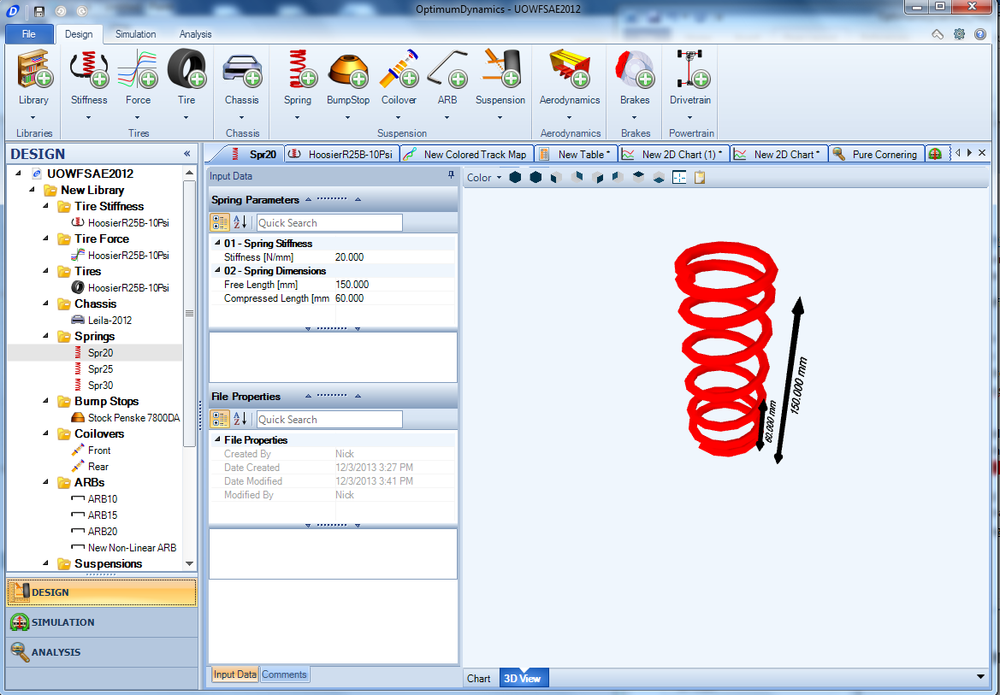

At multiple points during the design, simulation and analysis process a 3D visualization is possible. This is possible for the following:
 
* Design - Tire Stiffness

* Design - Tires

* Design - Chassis

* Design - Springs

* Design - Bump Stops

* Design - Coilovers

* Design - Suspensions

* Design - Brakes

* Design - Drivetrain

* Simulation - Vehicle Setup

* Results - Result Files

The 3D view is selectable in the document manager and will enable the display of a 3D visualization of the object. The following shortcuts are possible for navigating the object.

__Shortcut Key__  |  __Description__
-  |  -		
__Left Click + Drag__  |  Rotates the view
__Middle Click + Drag__  |  Zooms the view
__Mouse Wheel__  |  Zooms the view
__Right Click + Drag__  |  Pans the view
__Right Click__  |  Opens the shortcut menu

The following visualization options are accessible from the mini-toolbar at the top of the visualization window or from the 3D view shortcut menu (click the right mouse button in the window)

__Input Name__  |  __Description__
-  |  -	
__Background Color__  |  Select a background color for the 3D view
__Projection__  |  You can change between parallel and perspective projection
__Predefined Views__  |  You can switch to a predefined viewing position: Isometric Front Back Left Right Top Bottom
__Fill Mode__  |  You can specify between point fill, wireframe or solid fill
__Copy To Clipboard__  |  Copies an image of the visualization area to the clipboard
__Fit To Window__  |  Fits the suspension zoom level to fill the visualization window
