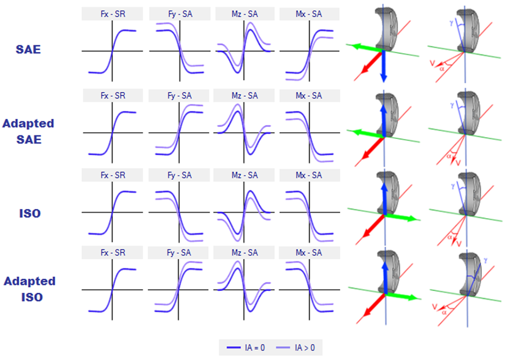

## My simulation does not converge!

There are a few common reasons for a simulation to not converge correctly. Firstly, you should check that the solver is failing by viewing the result file and selecting Solver Converged. This output channel is a true (output of 1) or false (output of 0) value describing whether each simulation step has failed. The solver will indicate after the simulation is complete if any step has not converged you will be notified. 

Another common reason for a simulation to have convergence issues is when unrealistic acceleration or force inputs are requested. Although the solver should still converge on a solution it may have issues if the inputs are simply too excessive. The non-convergence is either due to the tires not being able to provide enough force to reach the requested acceleration or the vehicle may be flipping over at the requested acceleration. If this is occurring, you need to either revise your simulation inputs or the vehicle setup being used.

One thing to check within the simulation is the tire model that is being used.  If the values for the tire model to not have a relative maximum within a realistic slip angle range, the solver will seek the maximum peak lateral force, which could cause the force applied to the vehicle at the CG to become great enough that the car will be solved for a roll over case and the simulation will not converge.  Car roll over can be checked by selecting the output channels for all wheels on ground and the wheel off ground distance.  This can also occur if the maximum lateral force for the tire is too great.  This can be remedied by using a scaling factor on the tire model.

Also check that the slip force conventions are correct for the tires.  If the slip angles are not correct, then the lateral forces will not converge.  Below are the correct tire curves for each convention available in OptimumDynamics.

The other thing to check is the springs, anti-roll bars, and downforce being used for the vehicle.  If the downforce being created is too great, then the lateral force for the simulation will be too great and the solver will not converge.  If the springs or anti-roll bars are too soft, the roll moment for the vehicle will be too little and the vehicle will be in a roll case, causing the solver to not converge.

## My acceleration output does not match my acceleration input?

This happens when the grip limit of the tires has been exceeded or in extreme cases where the simulation hasn’t converged (sees above). In the case of tire limit grip the solver can converge on a valid solution where the vehicle is not able to meet the requested simulation inputs. To solve this problem, you either need to request smaller input forces/accelerations or have a higher friction limit for the tire.

This problem often occurs when you try and run imported real-world data. The data is often scattered with high acceleration peaks that do not represent reality. You can try smoothing the data if this is the case.

##What does this “coilover out of range” mean?

This error message often occurs when a simulation is being run. It’s simply stating that the solver is guessing a position that is outside the valid coilover range. The solver will move on to a better guess when this one is found to be unsuccessful.

## Why do I get errors when running a full kinematics model?

The full kinematic models can sometimes be a little bit tricky to setup. There are a few issues that may be preventing a successful simulation. The first thing that you should do is check that each suspension is being calculated correctly. Try loading the suspension component by double clicking on it in the file explorer. Then click on the chart tab at the bottom of the window. If the suspension setup is valid you should see a 2D or 3D chart describing the suspension properties. If this does not occur, then you do have a problem in the full vehicle kinematics.

To solve this problem, you need to ensure that there were no coordinate input errors when defining point locations. You can see this visually as well in the 3D view where any large errors should be obvious.

Ensure that the coilover has the correct dimensions. The coilover must be able to reach the suspension position that was defined in the kinematics model.

## What coordinate system is being used in OptimumDynamics?

Please refer to the [vehicle conventions](../1_Getting_Started/D_Starting_a_Project.md) for an explanation of the coordinate system and direction being used in OptimumDynamics. 

## Why is the text blurry in OptimumDynamics?

If you have a high resolution, high DPI display, Microsoft Windows will automatically scale the user interface to correspond to the scaling set in your display settings. Consequently, this causes the OptimumDynamics UI to appear blurry. You can disable DPI scaling by going into the OptimumDynamics shortcut properties and selecting the ‘Disable display scaling on high DPI settings’ option in the compatibility tab.

